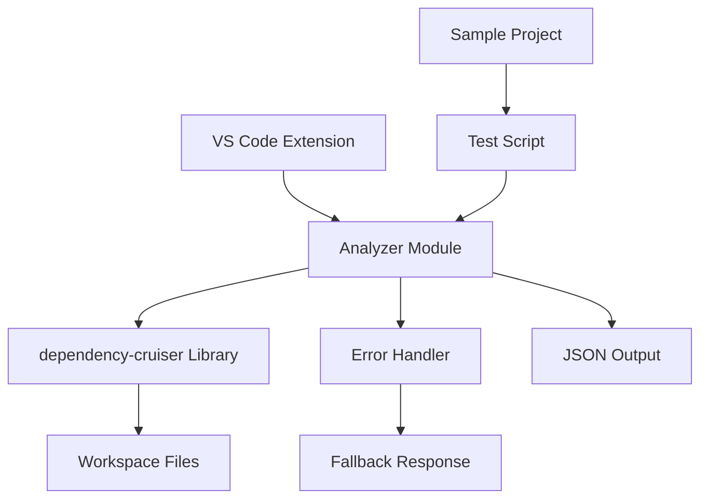

# Design Document

## Overview

The dependency analysis engine is a standalone module that integrates the `dependency-cruiser` library into the Kiro Constellation VS Code extension. It provides a robust, error-resilient way to analyze file dependencies within a workspace and generate structured JSON representations of the dependency graph. The engine is designed as a self-contained module with comprehensive error handling and testing capabilities.

## Architecture

### High-Level Architecture



### Module Structure

The analysis engine follows a modular architecture with clear separation of concerns:

- **Core Analyzer Module** (`src/analyzer.ts`): Main analysis logic and API
- **Error Handling Layer**: Comprehensive error management and fallback mechanisms  
- **Testing Infrastructure**: Isolated testing capabilities with sample projects
- **Integration Layer**: Clean API for extension integration

## Components and Interfaces

### Core Analyzer Module (`src/analyzer.ts`)

**Primary Interface:**
```typescript
export async function generateDependencyGraph(workspacePath: string): Promise<DependencyGraph>
```

**Key Responsibilities:**
- Configure and invoke dependency-cruiser programmatically
- Handle workspace path validation
- Process and format dependency-cruiser output
- Implement comprehensive error handling
- Return structured JSON dependency graph

**Configuration Strategy:**
- Use dependency-cruiser's JSON output format
- Configure for TypeScript/JavaScript file analysis
- Set appropriate file inclusion/exclusion patterns
- Optimize for VS Code workspace structures

### Error Handling Component

**Error Categories Handled:**
- Syntax errors in analyzed files
- Empty or invalid workspace directories
- dependency-cruiser library exceptions
- File system access issues
- Invalid workspace paths

**Fallback Strategy:**
```typescript
interface EmptyDependencyGraph {
  modules: [];
  summary: {
    error: string;
    totalDependencies: 0;
    violations: [];
  };
}
```

### Testing Infrastructure

**Test Script (`scripts/test-analyzer.ts`):**
- Isolated testing environment
- Sample project with known dependency relationships
- Console output verification
- Error scenario testing

**Sample Project Structure:**
```
sample-project/
├── a.js (imports b.js)
├── b.js (imports c.js)  
├── c.js (standalone)
└── package.json
```

## Data Models

### Input Model
```typescript
interface AnalyzerInput {
  workspacePath: string; // Absolute path to workspace root
}
```

### Output Model
```typescript
interface DependencyGraph {
  modules: DependencyModule[];
  summary: {
    totalDependencies: number;
    violations: Violation[];
    error?: string;
  };
}

interface DependencyModule {
  source: string;
  dependencies: Dependency[];
  dependents: string[];
}

interface Dependency {
  resolved: string;
  coreModule: boolean;
  followable: boolean;
  dynamic: boolean;
}
```

### Error Response Model
```typescript
interface AnalysisError {
  type: 'syntax' | 'filesystem' | 'library' | 'configuration';
  message: string;
  workspacePath: string;
  timestamp: string;
}
```

## Error Handling

### Error Handling Strategy

**Three-Layer Error Handling:**

1. **Input Validation Layer:**
   - Validate workspace path exists and is accessible
   - Check for minimum required files
   - Verify read permissions

2. **Library Integration Layer:**
   - Wrap dependency-cruiser calls in try-catch blocks
   - Handle library-specific exceptions
   - Manage configuration errors

3. **Output Processing Layer:**
   - Validate dependency-cruiser output format
   - Handle malformed or incomplete results
   - Ensure consistent return format

**Error Logging:**
- Use VS Code's output channel for debugging
- Include contextual information (workspace path, error type)
- Maintain error history for troubleshooting

**Graceful Degradation:**
- Always return valid JSON structure
- Provide meaningful error messages in response
- Maintain extension stability under all error conditions

## Testing Strategy

### Unit Testing Approach

**Isolated Module Testing:**
- Test analyzer module independently of VS Code extension
- Use sample projects with known dependency structures
- Verify JSON output format and content accuracy
- Test error handling scenarios

**Test Scenarios:**
1. **Happy Path Testing:**
   - Valid workspace with clear dependencies
   - Multiple file types (JS, TS, JSON)
   - Nested directory structures

2. **Error Scenario Testing:**
   - Empty directories
   - Syntax errors in source files
   - Invalid workspace paths
   - Permission denied scenarios

3. **Edge Case Testing:**
   - Circular dependencies
   - External module dependencies
   - Mixed file types
   - Large codebases

### Integration Testing

**Extension Integration:**
- Test analyzer integration with webview components
- Verify error handling in extension context
- Test performance with real-world projects

**Test Script Implementation:**
```typescript
// scripts/test-analyzer.ts
import { generateDependencyGraph } from '../src/analyzer';
import path from 'path';

async function testAnalyzer() {
  const samplePath = path.join(__dirname, '../sample-project');
  
  try {
    const result = await generateDependencyGraph(samplePath);
    console.log('✅ Analysis successful:', JSON.stringify(result, null, 2));
  } catch (error) {
    console.error('❌ Analysis failed:', error);
  }
}

testAnalyzer();
```

### Performance Considerations

**Optimization Strategies:**
- Implement file filtering to avoid analyzing unnecessary files
- Use dependency-cruiser's built-in caching mechanisms
- Consider workspace size limitations
- Implement timeout handling for large projects

**Memory Management:**
- Stream processing for large dependency graphs
- Cleanup temporary files and resources
- Monitor memory usage during analysis

### Security Considerations

**File System Security:**
- Validate workspace paths to prevent directory traversal
- Respect VS Code workspace boundaries
- Handle symbolic links safely

**Code Analysis Security:**
- Sandbox dependency-cruiser execution
- Limit analysis to workspace boundaries
- Handle potentially malicious code safely