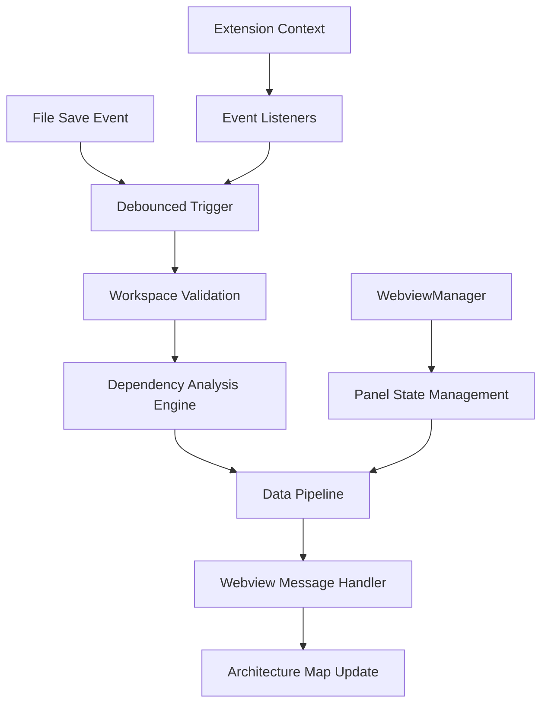

# Design Document

## Overview

The automated triggering and data pipeline system will transform the Kiro Constellation extension from a manual analysis tool into a live, reactive architecture visualization. The system leverages VS Code's file system events to automatically trigger dependency analysis when files are saved, then streams the results through a robust message-passing pipeline to update the webview in real-time.

The design emphasizes performance optimization through debouncing, proper state management for webview lifecycle, and comprehensive error handling to ensure the extension remains stable during intensive development sessions.

## Architecture

### High-Level Architecture



### Component Interaction Flow

1. **Event Detection**: VS Code's `workspace.onDidSaveTextDocument` captures file save events
2. **Performance Gating**: Lodash debounce function prevents excessive analysis during rapid saves
3. **Analysis Execution**: Existing `generateDependencyGraph` function processes the workspace
4. **State Validation**: System checks webview panel availability before data transmission
5. **Data Transmission**: Structured message sent via `webview.postMessage()` API
6. **Frontend Processing**: Webview receives and processes the dependency graph data

## Components and Interfaces

### 1. File Save Event Handler

**Location**: `src/extension.ts` (within `activate` function)

**Responsibilities**:
- Register VS Code workspace file save listener
- Validate workspace folder availability
- Coordinate with debounced analysis trigger

**Interface**:
```typescript
interface SaveEventHandler {
  register(): vscode.Disposable;
  handleSave(document: vscode.TextDocument): void;
}
```

### 2. Debounced Analysis Trigger

**Location**: `src/extension.ts` (module-level function)

**Responsibilities**:
- Implement 500ms debounce delay for performance optimization
- Maintain single analysis execution per debounce period
- Coordinate workspace validation and analysis execution

**Interface**:
```typescript
interface DebouncedTrigger {
  execute(): Promise<void>;
  cancel(): void;
}
```

**Implementation Details**:
- Uses Lodash `debounce` function with 500ms delay
- Created once during extension activation to maintain state
- Handles async analysis operations with proper error boundaries

### 3. Webview State Manager

**Location**: `src/ui/webview/WebviewManager.ts` (enhanced)

**Responsibilities**:
- Maintain reference to active webview panel
- Handle panel lifecycle events (creation, disposal)
- Provide safe data transmission interface
- Manage panel state across multiple creation/disposal cycles

**Interface**:
```typescript
interface WebviewStateManager {
  getActivePanel(): vscode.WebviewPanel | undefined;
  sendData(data: DependencyGraph): boolean;
  onPanelDisposed(callback: () => void): void;
}
```

**State Management**:
- Module-level variable stores current panel reference
- Automatic cleanup on panel disposal events
- Thread-safe access patterns for concurrent operations

### 4. Data Pipeline

**Location**: `src/extension.ts` (integrated with analysis trigger)

**Responsibilities**:
- Format dependency graph data for webview consumption
- Implement message protocol for frontend communication
- Handle transmission errors gracefully
- Provide structured logging for debugging

**Message Protocol**:
```typescript
interface PipelineMessage {
  command: 'updateGraph';
  data: DependencyGraph;
  timestamp: string;
  metadata: {
    moduleCount: number;
    analysisTime: number;
  };
}
```

### 5. Webview Message Receiver

**Location**: `src/ui/webview/webview.ts` (enhanced)

**Responsibilities**:
- Listen for incoming dependency graph messages
- Validate message structure and content
- Provide debugging feedback through console logging
- Prepare data for future visualization rendering

**Interface**:
```typescript
interface MessageReceiver {
  onMessage(handler: (message: PipelineMessage) => void): void;
  validateMessage(message: any): boolean;
}
```

## Data Models

### Enhanced Pipeline Message

```typescript
interface PipelineMessage {
  command: 'updateGraph' | 'analysisError' | 'analysisStart';
  data?: DependencyGraph;
  error?: string;
  timestamp: string;
  metadata: {
    workspacePath: string;
    moduleCount?: number;
    analysisTime?: number;
    triggerSource: 'filesSave' | 'manual';
  };
}
```

### Webview State

```typescript
interface WebviewState {
  panel: vscode.WebviewPanel | undefined;
  isActive: boolean;
  lastUpdate: string;
  messageQueue: PipelineMessage[];
}
```

### Analysis Context

```typescript
interface AnalysisContext {
  workspacePath: string;
  triggerTime: number;
  debounceActive: boolean;
  lastAnalysisTime?: number;
}
```

## Error Handling

### 1. Workspace Validation Errors

**Scenario**: No workspace folder open or invalid workspace
**Handling**: 
- Log warning message with context
- Skip analysis execution gracefully
- No error propagation to user interface

### 2. Analysis Engine Errors

**Scenario**: Dependency analysis fails due to code issues or file system problems
**Handling**:
- Leverage existing error handling in `generateDependencyGraph`
- Send error message to webview for user feedback
- Maintain system stability through fallback graph structure

### 3. Webview Communication Errors

**Scenario**: Webview panel disposed or message transmission fails
**Handling**:
- Validate panel existence before message sending
- Log transmission failures for debugging
- Queue messages for retry when panel becomes available

### 4. Debounce State Errors

**Scenario**: Debounce function state corruption or memory issues
**Handling**:
- Implement debounce function recreation on errors
- Provide fallback immediate execution mode
- Monitor debounce performance through logging

## Testing Strategy

### 1. Unit Testing

**File Save Event Handler**:
- Mock VS Code workspace API
- Verify event registration and cleanup
- Test workspace validation logic

**Debounced Trigger**:
- Test debounce timing accuracy
- Verify single execution per period
- Test cancellation behavior

**Data Pipeline**:
- Mock webview panel interface
- Test message formatting and transmission
- Verify error handling paths

### 2. Integration Testing

**End-to-End Pipeline**:
- Simulate file save events in test workspace
- Verify complete data flow from save to webview
- Test performance under rapid save scenarios

**Webview Lifecycle**:
- Test panel creation and disposal cycles
- Verify state cleanup and memory management
- Test message handling across panel recreations

### 3. Performance Testing

**Debounce Effectiveness**:
- Measure analysis frequency under rapid saves
- Verify 500ms delay accuracy
- Test memory usage during extended sessions

**Analysis Performance**:
- Benchmark analysis time for various project sizes
- Monitor memory usage during analysis operations
- Test system responsiveness during analysis

### 4. Manual Testing Scenarios

**Basic Functionality**:
- File save triggers analysis and webview update
- Webview displays received data in console
- Multiple rapid saves result in single analysis

**Error Scenarios**:
- No workspace folder open
- Webview panel closed during analysis
- Analysis engine errors handled gracefully

**Performance Scenarios**:
- Rapid file saves (5-10 saves in quick succession)
- Large project analysis performance
- Extended development session stability

## Implementation Phases

### Phase 1: Basic Event Handling
- Implement file save event listener
- Add workspace validation logic
- Create basic analysis trigger without debouncing
- Implement console logging for debugging

### Phase 2: Data Pipeline
- Enhance WebviewManager with state management
- Implement message transmission to webview
- Add webview message receiver
- Create structured message protocol

### Phase 3: Performance Optimization
- Add Lodash dependency for debouncing
- Implement debounced analysis trigger
- Add performance monitoring and logging
- Optimize message payload structure

### Phase 4: Error Handling & Polish
- Comprehensive error handling for all components
- Enhanced logging and debugging capabilities
- Performance monitoring and optimization
- Documentation and testing completion