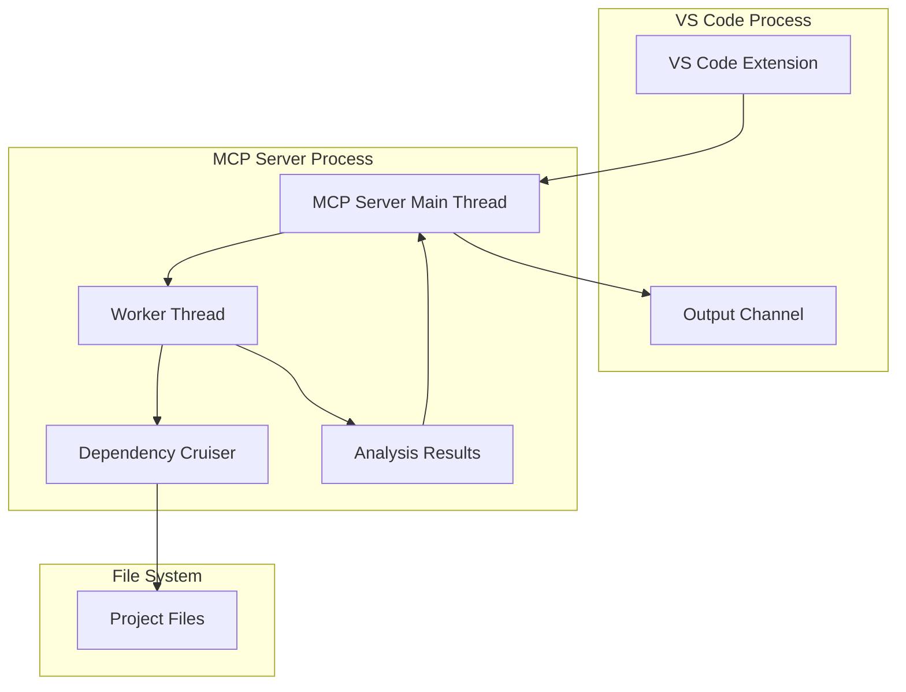
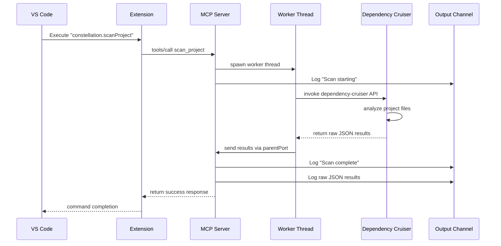

# Design Document

## Overview

The Scanner Command & Worker feature extends the existing Kiro Constellation MCP server architecture with codebase analysis capabilities using dependency-cruiser. The design leverages the established MCP (Model Context Protocol) communication pattern between VS Code and the MCP server, adding a new tool for project scanning that executes in a dedicated worker thread to maintain system responsiveness.

The architecture builds upon the existing `MCPStdioServer` class and follows the established patterns for tool registration and execution, while introducing worker thread management for CPU-intensive analysis tasks.

## Architecture

### High-Level Architecture



### Component Interaction Flow



## Components and Interfaces

### 1. VS Code Command Integration

**New Command Registration:**
```typescript
// In package.json contributes.commands
{
  "command": "constellation.scanProject",
  "title": "Constellation: Scan Project"
}
```

**Command Handler:**
```typescript
// In extension.ts
const scanProjectDisposable = vscode.commands.registerCommand('constellation.scanProject', async () => {
  log('Scan Project command executed');
  if (mcpProvider) {
    // FIXED: Pass extension context for reliable worker path resolution
    await mcpProvider.callTool('scan_project', { extensionContext: context });
  }
});
```

### 2. MCP Server Tool Extension

**New Tool Definition:**
```typescript
export const CONSTELLATION_SCAN_TOOL: ToolDefinition = {
  name: 'scan_project',
  description: 'Analyze project dependencies using dependency-cruiser in a worker thread',
  inputSchema: {
    type: 'object',
    properties: {
      targetPath: {
        type: 'string',
        description: 'Optional path to scan (defaults to workspace root)',
        default: '.'
      }
    },
    required: []
  }
};
```

**Tool Handler Implementation:**
```typescript
// In MCPStdioServer class
if (name === CONSTELLATION_SCAN_TOOL.name) {
  const targetPath = (args?.targetPath as string) || '.';
  const extensionContext = args?.extensionContext as vscode.ExtensionContext;
  
  if (!extensionContext) {
    throw new Error('Extension context required for worker path resolution');
  }
  
  return await this.executeScanInWorker(targetPath, extensionContext);
}
```

### 3. Worker Thread Management

**Worker Thread Interface:**
```typescript
interface ScanWorkerMessage {
  type: 'status' | 'result' | 'error';
  data: {
    status?: 'starting' | 'complete';
    result?: any;
    error?: string;
    timestamp: string;
  };
}

interface ScanWorkerData {
  targetPath: string;
  workspaceRoot: string;
}
```

**Worker Thread Implementation:**
```typescript
// New file: src/workers/scanWorker.ts
import { parentPort, workerData } from 'worker_threads';
import { cruise } from 'dependency-cruiser';

const executeScan = async (data: ScanWorkerData) => {
  try {
    // Send starting status
    parentPort?.postMessage({
      type: 'status',
      data: { status: 'starting', timestamp: new Date().toISOString() }
    });

    // Configure dependency-cruiser
    const config = {
      // Default configuration respecting .gitignore
      exclude: {
        path: 'node_modules'
      },
      options: {
        doNotFollow: {
          path: 'node_modules'
        }
      }
    };

    // FIXED: cruise() is async - await the result and validate structure
    const cruiseResult = await cruise([data.targetPath], config);
    
    // FIXED: Validate result structure before accessing properties
    if (!cruiseResult || typeof cruiseResult !== 'object') {
      throw new Error('Invalid result from dependency-cruiser');
    }
    
    // FIXED: Check if output property exists and has expected structure
    const output = cruiseResult.output || cruiseResult;
    if (!output) {
      throw new Error('No output data from dependency-cruiser');
    }

    // Send results
    parentPort?.postMessage({
      type: 'result',
      data: { 
        result: output,
        timestamp: new Date().toISOString()
      }
    });

  } catch (error) {
    parentPort?.postMessage({
      type: 'error',
      data: { 
        error: error instanceof Error ? error.message : String(error),
        timestamp: new Date().toISOString()
      }
    });
  }
};

if (workerData) {
  executeScan(workerData);
}
```

### 4. MCP Server Worker Management

**Worker Management Methods:**
```typescript
// In MCPStdioServer class
private async executeScanInWorker(targetPath: string, extensionContext: vscode.ExtensionContext): Promise<any> {
  return new Promise((resolve, reject) => {
    // FIXED: Use ExtensionContext for reliable path resolution
    const workerUri = vscode.Uri.joinPath(extensionContext.extensionUri, 'dist/workers/scanWorker.mjs');
    const workerPath = workerUri.fsPath;
    
    // FIXED: Validate target path to prevent directory traversal
    const workspaceRoot = vscode.workspace.workspaceFolders?.[0]?.uri.fsPath;
    if (!workspaceRoot) {
      reject(new Error('No workspace folder open'));
      return;
    }
    
    const resolvedTargetPath = path.resolve(workspaceRoot, targetPath);
    if (!resolvedTargetPath.startsWith(workspaceRoot)) {
      reject(new Error('Target path must be within workspace'));
      return;
    }

    const worker = new Worker(workerPath, {
      workerData: {
        targetPath: resolvedTargetPath,
        workspaceRoot
      }
    });

    worker.on('message', (message: ScanWorkerMessage) => {
      this.handleWorkerMessage(message, resolve, reject);
    });

    worker.on('error', (error) => {
      console.error('[SCAN ERROR]', error.message);
      reject(error);
    });

    worker.on('exit', (code) => {
      if (code !== 0) {
        reject(new Error(`Worker stopped with exit code ${code}`));
      }
    });
  });
}

private handleWorkerMessage(
  message: ScanWorkerMessage, 
  resolve: Function, 
  reject: Function
): void {
  const { type, data } = message;
  
  switch (type) {
    case 'status':
      console.error(`[SCAN STATUS] ${data.status} at ${data.timestamp}`);
      break;
      
    case 'result':
      console.error(`[SCAN COMPLETE] at ${data.timestamp}`);
      console.error('[SCAN RESULTS]', JSON.stringify(data.result, null, 2));
      resolve({
        content: [{
          type: 'text' as const,
          text: `Scan completed successfully. Results logged to output channel.`
        }]
      });
      break;
      
    case 'error':
      console.error(`[SCAN ERROR] ${data.error} at ${data.timestamp}`);
      reject(new Error(data.error));
      break;
  }
}
```

## Data Models

### Scan Configuration Model
```typescript
interface ScanConfiguration {
  targetPath: string;
  exclude?: {
    path: string | string[];
  };
  options?: {
    doNotFollow?: {
      path: string | string[];
    };
    includeOnly?: string | string[];
  };
}
```

### Scan Result Model
```typescript
interface ScanResult {
  summary: {
    totalModules: number;
    totalDependencies: number;
    violations: number;
  };
  modules: Array<{
    source: string;
    dependencies: Array<{
      resolved: string;
      coreModule: boolean;
      followable: boolean;
      dynamic: boolean;
    }>;
  }>;
}
```

### Worker Message Protocol
```typescript
type WorkerMessageType = 'status' | 'result' | 'error';

interface BaseWorkerMessage {
  type: WorkerMessageType;
  data: {
    timestamp: string;
  };
}

interface StatusMessage extends BaseWorkerMessage {
  type: 'status';
  data: BaseWorkerMessage['data'] & {
    status: 'starting' | 'complete';
  };
}

interface ResultMessage extends BaseWorkerMessage {
  type: 'result';
  data: BaseWorkerMessage['data'] & {
    result: ScanResult;
  };
}

interface ErrorMessage extends BaseWorkerMessage {
  type: 'error';
  data: BaseWorkerMessage['data'] & {
    error: string;
  };
}
```

## Error Handling

### Extension Level
- **MCP Provider Unavailable**: Graceful degradation with user notification
- **Tool Call Failures**: Log errors and show user-friendly messages
- **Command Execution Errors**: Proper error logging without crashing extension

### MCP Server Level
- **Worker Thread Creation Failures**: Log errors and return appropriate tool response
- **Worker Communication Errors**: Handle message parsing failures gracefully
- **Multiple Concurrent Scans**: Queue management or rejection of concurrent requests

### Worker Thread Level
- **Dependency-Cruiser Errors**: Capture and report configuration or execution errors
- **File System Access Errors**: Handle permission or path-related issues
- **Memory/Resource Constraints**: Proper cleanup and error reporting

### Dependency-Cruiser Integration
- **API Safety**: CRITICAL - Validate dependency-cruiser result structure before accessing properties to prevent runtime errors
- **Async API Handling**: cruise() function is asynchronous and must be awaited properly
- **Configuration Errors**: Validate configuration before execution
- **Large Project Handling**: Monitor memory usage and provide progress feedback
- **Unsupported File Types**: Handle gracefully with appropriate filtering

## Testing Strategy

### Unit Tests
- **Tool Registration**: Verify scan_project tool is properly registered
- **Worker Thread Management**: Test worker creation, communication, and cleanup
- **Message Protocol**: Test all worker message types and error conditions
- **Configuration Generation**: Test default configuration creation

### Integration Tests
- **End-to-End Command Flow**: Test complete flow from VS Code command to output
- **MCP Tool Execution**: Test tool call through MCP protocol
- **Worker Thread Communication**: Test message passing between main thread and worker
- **Dependency-Cruiser Integration**: Test actual scanning with sample projects

### Performance Tests
- **Large Project Scanning**: Test with projects of varying sizes
- **Memory Usage**: Monitor worker thread memory consumption
- **Concurrent Request Handling**: Test behavior with multiple scan requests
- **Worker Thread Lifecycle**: Test proper cleanup and resource management

### Test Data and Scenarios
- **Sample Projects**: Create test projects with known dependency structures
- **Error Scenarios**: Test with invalid paths, permission issues, corrupted files
- **Edge Cases**: Empty projects, circular dependencies, missing dependencies
- **Configuration Variations**: Test different dependency-cruiser configurations

## Build Configuration Requirements

### Critical Build Path Alignment
The build system must be configured to ensure worker thread files are compiled to the exact paths expected by the runtime code:

**esbuild Configuration:**
```javascript
// In esbuild.js - Worker thread build configuration
{
  entryPoints: ['src/workers/scanWorker.ts'],
  outfile: 'dist/workers/scanWorker.mjs', // CRITICAL: Must match runtime path
  format: 'esm',
  platform: 'node',
  target: 'node16',
  bundle: true,
  external: ['dependency-cruiser']
}
```

**Runtime Path Resolution:**
```typescript
// In MCPStdioServer - Must match build output exactly
const workerUri = vscode.Uri.joinPath(extensionContext.extensionUri, 'dist/workers/scanWorker.mjs');
```

### Build System Validation
- Build output path MUST exactly match the path used in `new Worker()` constructor
- Worker files MUST be compiled as ES modules (.mjs) for proper Node.js worker thread support
- Build process MUST ensure worker files are included in the extension bundle
- Extension packaging MUST include the compiled worker files in the correct directory structure

## Implementation Notes

### Technology Choices
- **Worker Threads**: Node.js worker_threads for CPU-intensive tasks without blocking
- **Dependency-Cruiser**: Established tool for dependency analysis with rich configuration options
- **MCP Protocol**: Leverages existing communication infrastructure
- **Stdio Transport**: Maintains consistency with existing MCP server implementation

### Security Considerations
- **File System Access**: Worker threads inherit parent process permissions
- **Path Validation**: CRITICAL - All target paths must be validated to ensure they are within the workspace root to prevent directory traversal attacks
- **Resource Limits**: Consider implementing timeouts and memory limits for worker threads
- **Worker Path Resolution**: Use VS Code ExtensionContext for reliable and secure worker file path resolution

### Performance Considerations
- **Non-Blocking Architecture**: Worker threads prevent main thread blocking
- **Memory Management**: Proper cleanup of worker threads and large result objects
- **Concurrent Scan Handling**: Strategy for handling multiple simultaneous scan requests
- **Result Size Management**: Consider streaming or chunking for very large analysis results

### Configuration Strategy
- **Default Configuration**: Sensible defaults that work for most TypeScript/JavaScript projects
- **Gitignore Respect**: Automatically exclude files/directories from .gitignore
- **Source Directory Targeting**: Focus on common source directories (src, lib, etc.)
- **Future Extensibility**: Design allows for custom configuration in future iterations