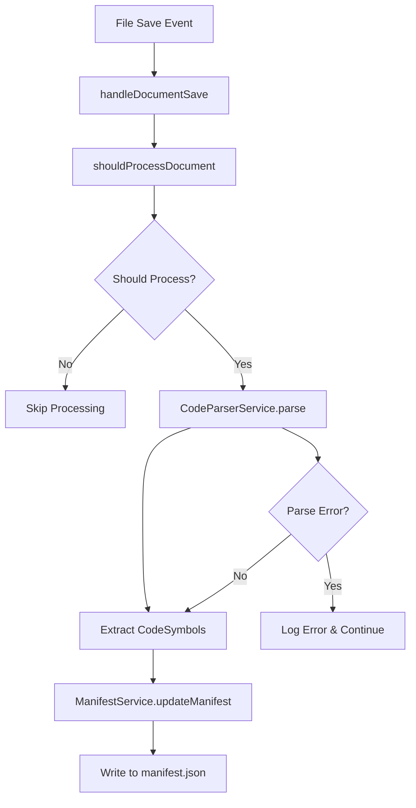

# Design Document

## Overview

The structural indexing feature extends the existing file save event handling system to parse TypeScript/JavaScript files and extract structural metadata. The system leverages Babel's parsing capabilities to create an Abstract Syntax Tree (AST) and traverse it to identify code symbols like functions, classes, interfaces, and their associated JSDoc comments. This metadata is then stored in a centralized manifest.json file for efficient access by other tools and features.

The design builds upon the existing architecture with a `handleDocumentSave` function, `shouldProcessDocument` filtering, and `processDocument` logic, adding a new parsing layer that integrates seamlessly with the current workflow.

## Architecture

### High-Level Flow
1. File save event triggers existing `handleDocumentSave` function
2. Document passes through existing filtering (`shouldProcessDocument`)
3. New `CodeParserService` parses the document content and extracts symbols
4. New `ManifestService` updates the centralized manifest.json file
5. Error handling ensures system stability throughout the process

### Component Interaction


## Components and Interfaces

### Type Definitions (src/types.ts)

```typescript
/**
 * Represents a code symbol extracted from source files
 */
export interface CodeSymbol {
    /** Symbol name (function name, class name, etc.) */
    name: string;
    /** Type of symbol (function, class, interface, etc.) */
    type: 'function' | 'class' | 'interface' | 'type' | 'variable' | 'method' | 'property';
    /** JSDoc comment content, if present */
    documentation?: string;
    /** Location information */
    location: SymbolLocation;
    /** Additional metadata specific to symbol type */
    metadata?: SymbolMetadata;
}

/**
 * Location information for a code symbol
 */
export interface SymbolLocation {
    /** File path relative to workspace root */
    filePath: string;
    /** Starting line number (1-based) */
    startLine: number;
    /** Starting column number (0-based) */
    startColumn: number;
    /** Ending line number (1-based) */
    endLine: number;
    /** Ending column number (0-based) */
    endColumn: number;
}

/**
 * Additional metadata for different symbol types
 */
export interface SymbolMetadata {
    /** Function parameters (for functions/methods) */
    parameters?: string[];
    /** Return type (for functions/methods) */
    returnType?: string;
    /** Parent class/interface (for methods/properties) */
    parent?: string;
    /** Access modifier (public, private, protected) */
    accessibility?: 'public' | 'private' | 'protected';
}

/**
 * Structure of the manifest.json file
 */
export interface Manifest {
    /** Timestamp of last update */
    lastUpdated: string;
    /** Version of the manifest format */
    version: string;
    /** Map of file paths to their extracted symbols */
    files: Record<string, CodeSymbol[]>;
}
```

### CodeParserService (src/services/CodeParserService.ts)

The `CodeParserService` is responsible for parsing source code and extracting structural metadata using Babel's AST parsing capabilities.

**Key Responsibilities:**
- Parse TypeScript/JavaScript code using `@babel/parser`
- Traverse the AST using `@babel/traverse` to identify symbols
- Extract JSDoc comments and associate them with symbols
- Handle different file types (.ts, .js, .tsx, .jsx) with appropriate parser options
- Provide error handling for malformed code

**API Design:**
```typescript
export class CodeParserService {
    /**
     * Parses source code and extracts structural symbols
     * @param content - Source code content
     * @param filePath - File path for location tracking
     * @param fileExtension - File extension to determine parser options
     * @returns Array of extracted code symbols
     */
    public parseCode(content: string, filePath: string, fileExtension: string): CodeSymbol[];
    
    /**
     * Determines parser options based on file extension
     * @param fileExtension - File extension (.ts, .js, .tsx, .jsx)
     * @returns Babel parser options
     */
    private getParserOptions(fileExtension: string): ParserOptions;
    
    /**
     * Extracts JSDoc comment from AST node
     * @param node - AST node
     * @returns JSDoc comment content or undefined
     */
    private extractJSDoc(node: any): string | undefined;
}
```

### ManifestService (src/services/ManifestService.ts)

The `ManifestService` handles all file I/O operations for the manifest.json file, including reading, updating, and writing the structural index data.

**Key Responsibilities:**
- Read existing manifest.json file safely
- Update manifest data for specific files
- Write updated manifest back to disk
- Create .constellation directory if it doesn't exist
- Handle file system errors gracefully

**API Design:**
```typescript
export class ManifestService {
    private readonly manifestPath: string;
    
    /**
     * Reads the current manifest from disk
     * @returns Current manifest object or empty manifest if file doesn't exist
     */
    public async readManifest(): Promise<Manifest>;
    
    /**
     * Updates the manifest with symbols for a specific file
     * @param filePath - File path to update
     * @param symbols - Array of code symbols for the file
     */
    public async updateFileSymbols(filePath: string, symbols: CodeSymbol[]): Promise<void>;
    
    /**
     * Writes the manifest object to disk
     * @param manifest - Manifest object to write
     */
    private async writeManifest(manifest: Manifest): Promise<void>;
    
    /**
     * Ensures the .constellation directory exists
     */
    private async ensureDirectoryExists(): Promise<void>;
}
```

## Data Models

### Manifest File Structure
The manifest.json file will be stored at `/.constellation/manifest.json` with the following structure:

```json
{
  "lastUpdated": "2024-01-15T10:30:00.000Z",
  "version": "1.0.0",
  "files": {
    "src/utils/helper.ts": [
      {
        "name": "calculateSum",
        "type": "function",
        "documentation": "Calculates the sum of two numbers",
        "location": {
          "filePath": "src/utils/helper.ts",
          "startLine": 5,
          "startColumn": 0,
          "endLine": 7,
          "endColumn": 1
        },
        "metadata": {
          "parameters": ["a: number", "b: number"],
          "returnType": "number"
        }
      }
    ]
  }
}
```

### Symbol Type Mapping
The parser will identify and categorize the following symbol types:
- **function**: Function declarations and expressions
- **class**: Class declarations
- **interface**: TypeScript interface declarations
- **type**: TypeScript type aliases
- **variable**: Variable declarations (const, let, var)
- **method**: Class methods
- **property**: Class properties

## Error Handling

### Parsing Errors
- **Syntax Errors**: Log error and skip file indexing, don't crash extension
- **Unsupported Syntax**: Log warning and extract what's possible
- **Large Files**: Implement timeout mechanism to prevent blocking

### File System Errors
- **Permission Issues**: Log error and continue with other files
- **Disk Space**: Handle write failures gracefully
- **Directory Creation**: Retry mechanism for directory creation

### Error Recovery Strategy
```typescript
try {
    // Parse and index file
} catch (parseError) {
    console.error(`Failed to parse ${filePath}:`, parseError);
    // Continue processing other files
} catch (fileSystemError) {
    console.error(`File system error for ${filePath}:`, fileSystemError);
    // Attempt retry or skip
}
```

## Performance Considerations

### Parsing Optimization
- **Incremental Parsing**: Only parse changed files
- **Caching**: Cache parsed results for unchanged files
- **Async Processing**: Ensure parsing doesn't block UI thread

### Memory Management
- **AST Cleanup**: Properly dispose of AST objects after parsing
- **Manifest Size**: Monitor manifest file size and implement cleanup if needed
- **Concurrent Processing**: Handle multiple rapid file saves efficiently

### Scalability
- **Deep Nesting**: Handle deeply nested code structures
- **Complex Types**: Ensure performance with complex TypeScript types