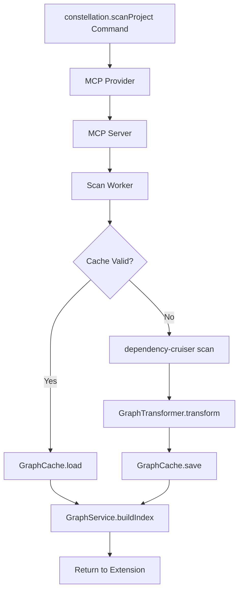

# Design Document

## Overview

This design extends the existing `constellation.scanProject` command to transform raw dependency-cruiser output into a clean Graph Domain Model and implement local caching with reverse-dependency indexing. The solution builds upon the current worker-based scanning architecture while adding three new services: GraphTransformer, GraphCache, and GraphService.

## Architecture

### Current Architecture Integration

The design integrates with the existing architecture:
- **Extension Entry Point**: `src/extension.ts` - hosts the `constellation.scanProject` command
- **MCP Provider**: `src/mcp/mcp.provider.ts` - orchestrates the scan process
- **MCP Server**: `src/mcp/mcp-stdio.server.ts` - executes scans via worker threads
- **Scan Worker**: `src/workers/scan-project.worker.ts` - performs dependency-cruiser scanning

### New Components

```
src/
├── services/
│   ├── graph-transformer.service.ts    # Transforms raw scan data to graph model
│   ├── graph-cache.service.ts          # Handles cache persistence and validation
│   └── graph.service.ts                # Provides graph access and reverse-dependency index
├── types/
│   └── graph.types.ts                  # Graph domain model interfaces
└── workers/
    └── scan-project.worker.ts          # Extended to use new services
```

### Data Flow



## Components and Interfaces

### Graph Domain Model Types

```typescript
// src/types/graph.types.ts
export interface IConstellationNode {
  id: string;        // Normalized, workspace-relative file path
  path: string;      // The absolute file path
  label: string;     // The file name for display
  package?: string;  // For monorepos, the name of the package it belongs to
}

export interface IConstellationEdge {
  source: string;    // ID of the source node
  target: string;    // ID of the target node
}

export interface IConstellationGraph {
  nodes: IConstellationNode[];
  edges: IConstellationEdge[];
  metadata: {
    timestamp: string;
    workspaceRoot: string;
    scanPath: string;
  };
}

export interface ICacheValidationResult {
  isValid: boolean;
  reason?: string;
  cacheTimestamp?: Date;
  keyFileTimestamp?: Date;
}
```

### GraphTransformer Service

```typescript
// src/services/graph-transformer.service.ts
export class GraphTransformer {
  /**
   * Transform raw dependency-cruiser output into graph domain model
   */
  static transform(rawData: any, workspaceRoot: string, scanPath: string): IConstellationGraph;
  
  private static createNode(module: any, workspaceRoot: string): IConstellationNode;
  private static createEdges(module: any, workspaceRoot: string): IConstellationEdge[];
  private static normalizeId(filePath: string, workspaceRoot: string): string;
  private static extractPackageName(filePath: string, workspaceRoot: string): string | undefined;
}
```

### GraphCache Service

```typescript
// src/services/graph-cache.service.ts
export class GraphCache {
  private static readonly CACHE_DIR = '.constellation-cache';
  private static readonly CACHE_FILE = 'graph-v1.json';
  private static readonly KEY_FILES = ['package.json', 'pnpm-lock.yaml', 'tsconfig.json'];
  
  /**
   * Save graph to local cache
   */
  static async save(graph: IConstellationGraph, workspaceRoot: string): Promise<void>;
  
  /**
   * Load graph from cache if valid
   */
  static async load(workspaceRoot: string): Promise<IConstellationGraph | null>;
  
  /**
   * Check if cache is valid by comparing timestamps
   */
  static async validateCache(workspaceRoot: string): Promise<ICacheValidationResult>;
  
  private static getCachePath(workspaceRoot: string): string;
  private static getKeyFileTimestamps(workspaceRoot: string): Promise<Date[]>;
  private static ensureCacheDirectory(workspaceRoot: string): Promise<void>;
}
```

### GraphService

```typescript
// src/services/graph.service.ts
export class GraphService {
  private static instance: GraphService | null = null;
  private graph: IConstellationGraph | null = null;
  private reverseDependencyIndex: Map<string, string[]> = new Map();
  
  /**
   * Get singleton instance
   */
  static getInstance(): GraphService;
  
  /**
   * Load graph and build reverse-dependency index
   */
  async loadGraph(workspaceRoot: string, scanPath: string): Promise<IConstellationGraph>;
  
  /**
   * Get dependents of a file (O(1) lookup)
   */
  getDependentsOf(fileId: string): string[];
  
  /**
   * Get current graph
   */
  getGraph(): IConstellationGraph | null;
  
  /**
   * Build reverse-dependency index from graph
   */
  private buildReverseDependencyIndex(): void;
  
  /**
   * Clear cached data
   */
  clear(): void;
}
```

## Data Models

### Cache File Structure

The cache file `.constellation-cache/graph-v1.json` will contain:

```json
{
  "nodes": [
    {
      "id": "src/extension.ts",
      "path": "/absolute/path/to/src/extension.ts",
      "label": "extension.ts",
      "package": "kiro-constellation"
    }
  ],
  "edges": [
    {
      "source": "src/extension.ts",
      "target": "src/mcp/mcp.provider.ts"
    }
  ],
  "metadata": {
    "timestamp": "2025-08-23T10:30:00.000Z",
    "workspaceRoot": "/absolute/path/to/workspace",
    "scanPath": "."
  }
}
```

### Reverse-Dependency Index Structure

In-memory Map structure:
```typescript
Map<string, string[]> {
  "src/mcp/mcp.provider.ts" => ["src/extension.ts"],
  "src/types/scanner.types.ts" => ["src/workers/scan-project.worker.ts", "src/mcp/mcp-stdio.server.ts"]
}
```

## Error Handling

### Cache Validation Errors
- **Missing cache file**: Fall back to full scan
- **Corrupted cache file**: Log warning, delete cache, perform full scan
- **Key file timestamp newer**: Invalidate cache, perform full scan

### Transformation Errors
- **Invalid dependency-cruiser output**: Throw descriptive error with context
- **Missing required fields**: Log warning, skip invalid modules
- **Path resolution errors**: Use fallback path normalization

### File System Errors
- **Cache directory creation failure**: Log error, continue without caching
- **Cache write failure**: Log warning, continue with in-memory data
- **Permission errors**: Provide helpful error message with suggested fixes

## Implementation Considerations

### Backward Compatibility
- Existing `constellation.scanProject` command behavior remains unchanged
- New functionality is additive - no breaking changes to current API
- Cache files are workspace-local and optional

### Performance Optimizations
- Lazy loading of graph data until first access
- Efficient JSON serialization for cache files
- Memory-efficient reverse-dependency index using Map data structure

### Security Considerations
- Path validation to prevent directory traversal attacks
- Workspace boundary enforcement for cache file locations
- Safe JSON parsing with error handling

### Scalability
- Cache file size monitoring for large projects
- Configurable cache retention policies (future enhancement)
- Incremental cache updates (future enhancement)