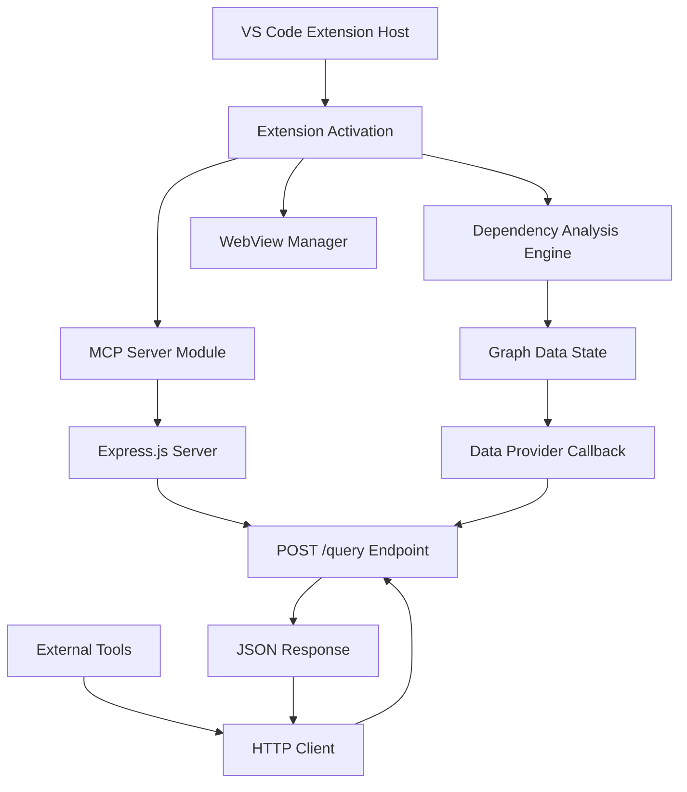
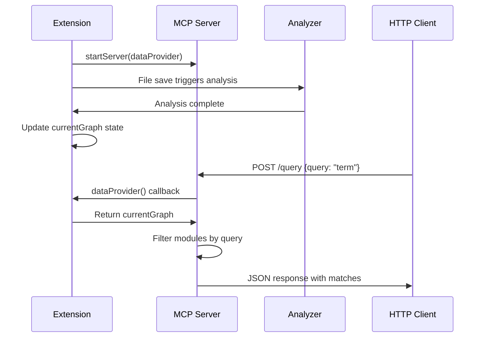

# Design Document

## Overview

The Local MCP Server feature will implement a lightweight Express.js HTTP server that runs within the Kiro Constellation VS Code extension process. This server will expose a REST API endpoint that allows external tools and services to query the extension's dependency graph data. The server will be tightly integrated with the existing dependency analysis engine while maintaining proper separation of concerns through a callback-based data provider pattern.

## Architecture

### High-Level Architecture



### Server Lifecycle Integration

The MCP server will be integrated into the extension's lifecycle through the existing `activate()` and `deactivate()` functions:

1. **Activation**: Server starts when extension activates
2. **Data Synchronization**: Server receives updated graph data through callback mechanism
3. **Query Processing**: Server handles HTTP requests using latest graph data
4. **Deactivation**: Server gracefully shuts down when extension deactivates

### Data Flow Architecture



## Components and Interfaces

### 1. MCP Server Module (`src/mcpServer.ts`)

**Primary Responsibilities:**
- Express.js server lifecycle management
- HTTP request/response handling
- Query processing and filtering
- Error handling and logging

**Key Interfaces:**

```typescript
// Data provider callback type
export type GraphDataProvider = () => IReporterOutput;

// Server management functions
export function startServer(
  graphDataProvider: GraphDataProvider, 
  port?: number
): Promise<void>;

export function stopServer(): Promise<void>;

// Query request/response types
interface QueryRequest {
  query: string;
}

interface QueryResponse {
  matches: string[];
  total: number;
}
```

**Internal Architecture:**
- Module-level server instance variable for lifecycle management
- Express middleware for JSON parsing and error handling
- Configurable port with fallback mechanism
- Graceful shutdown handling

### 2. Extension Integration (`src/extension.ts`)

**Enhanced Responsibilities:**
- MCP server lifecycle management
- Graph data state management
- Data provider callback implementation

**Key Changes:**

```typescript
// Module-level graph state
let currentGraph: IReporterOutput = { modules: [], summary: {} };

// Data provider function
const graphDataProvider: GraphDataProvider = () => currentGraph;

// Enhanced activation function
export function activate(context: vscode.ExtensionContext) {
  // Existing code...
  
  // Start MCP server
  startServer(graphDataProvider).catch(error => {
    console.error('Failed to start MCP server:', error);
  });
  
  // Enhanced analysis function
  async function performDependencyAnalysis(workspaceRoot: string) {
    // Existing analysis code...
    
    // Update graph state for MCP server
    currentGraph = dependencyGraph;
  }
}

// Enhanced deactivation function
export function deactivate() {
  return stopServer();
}
```

### 3. Query Processing Logic

**Search Algorithm:**
- Case-insensitive substring matching against module source paths
- Support for partial path matching (e.g., "service" matches "src/services/auth.ts")
- Return array of matching file paths
- Include total count for client convenience

**Query Processing Flow:**
1. Validate query parameter exists and is non-empty string
2. Retrieve latest graph data via callback
3. Filter modules array using case-insensitive search
4. Extract source paths from matching modules
5. Return structured JSON response

## Data Models

### Input Data Model

The server will consume the existing `IReporterOutput` interface from dependency-cruiser:

```typescript
interface IReporterOutput {
  modules: Array<{
    source: string;
    dependencies: Array<{
      resolved: string;
      coreModule: boolean;
      followable: boolean;
      dynamic: boolean;
    }>;
    dependents: string[];
  }>;
  summary: {
    totalDependencies?: number;
    violations?: Array<{
      from: string;
      to: string;
      rule: {
        severity: string;
        name: string;
      };
    }>;
    error?: string;
  };
}
```

### API Data Models

**Request Model:**
```typescript
interface QueryRequest {
  query: string;  // Search term for file paths
}
```

**Response Model:**
```typescript
interface QueryResponse {
  matches: string[];  // Array of matching file paths
  total: number;      // Count of matches
  timestamp: string;  // Response timestamp
}
```

**Error Response Model:**
```typescript
interface ErrorResponse {
  error: string;      // Error message
  code: string;       // Error code
  timestamp: string;  // Error timestamp
}
```

## Error Handling

### Server Startup Errors

1. **Port Already in Use**: Attempt alternative ports (6170-6179) with fallback logging
2. **Permission Errors**: Log error and continue extension activation without server
3. **Express Initialization Errors**: Comprehensive error logging with context

### Request Processing Errors

1. **Invalid Query Parameter**: Return 400 Bad Request with descriptive message
2. **Data Provider Errors**: Return 500 Internal Server Error with generic message
3. **JSON Parsing Errors**: Return 400 Bad Request for malformed requests
4. **Server Unavailable**: Return 503 Service Unavailable during shutdown

### Error Response Format

```typescript
// Standard error response structure
{
  "error": "Descriptive error message",
  "code": "ERROR_CODE",
  "timestamp": "2024-01-01T12:00:00.000Z"
}
```

### Logging Strategy

- Use existing extension logging patterns with `console.log` prefixed with `🚀 KIRO-CONSTELLATION:`
- Log server lifecycle events (start, stop, errors)
- Log request processing errors with sanitized details
- Avoid logging sensitive information or full graph data

## Testing Strategy

### Unit Testing Approach

**MCP Server Module Tests:**
- Server lifecycle (start/stop) functionality
- Query processing logic with various input scenarios
- Error handling for invalid requests and server errors
- Data provider callback integration

**Test Structure:**
```typescript
describe('MCP Server', () => {
  describe('Server Lifecycle', () => {
    it('should start server on specified port');
    it('should handle port conflicts gracefully');
    it('should stop server cleanly');
  });
  
  describe('Query Processing', () => {
    it('should filter modules by query term');
    it('should handle case-insensitive matching');
    it('should return empty array for no matches');
    it('should validate query parameter');
  });
  
  describe('Error Handling', () => {
    it('should handle missing query parameter');
    it('should handle data provider errors');
    it('should return proper error responses');
  });
});
```

### Integration Testing

**Extension Integration Tests:**
- Server starts during extension activation
- Server receives updated graph data after analysis
- Server stops during extension deactivation
- End-to-end query flow with real dependency data

### Manual Testing Protocol

1. **Server Startup**: Verify server starts on extension activation
2. **Query Functionality**: Test various query patterns using curl/Postman
3. **Data Synchronization**: Verify queries return updated data after file saves
4. **Error Scenarios**: Test invalid requests and server error conditions
5. **Server Shutdown**: Verify clean shutdown on extension deactivation

### Test Data Scenarios

- Empty dependency graph (no modules)
- Single module with no dependencies
- Multiple modules with various path patterns
- Modules with special characters in paths
- Large dependency graphs (performance testing)

## Security Considerations

### Network Security

- Server binds to localhost only (127.0.0.1) to prevent external access
- No authentication required since server is local-only
- Consider adding basic rate limiting for production use

### Data Exposure

- Only expose file paths, not file contents
- Sanitize error messages to avoid information leakage
- Log security-relevant events for monitoring

### Input Validation

- Validate all query parameters for type and length
- Sanitize query strings to prevent injection attacks
- Implement request size limits to prevent DoS

## Performance Considerations

### Memory Management

- Avoid storing duplicate graph data in server module
- Use callback pattern to access latest data without copying
- Implement efficient string matching algorithms

### Response Time Optimization

- Cache query results for identical queries (future enhancement)
- Limit response size for large result sets
- Use streaming responses for very large datasets (future enhancement)

### Scalability

- Single-threaded Express server suitable for local development use
- Consider connection limits for production deployment
- Monitor memory usage during large project analysis