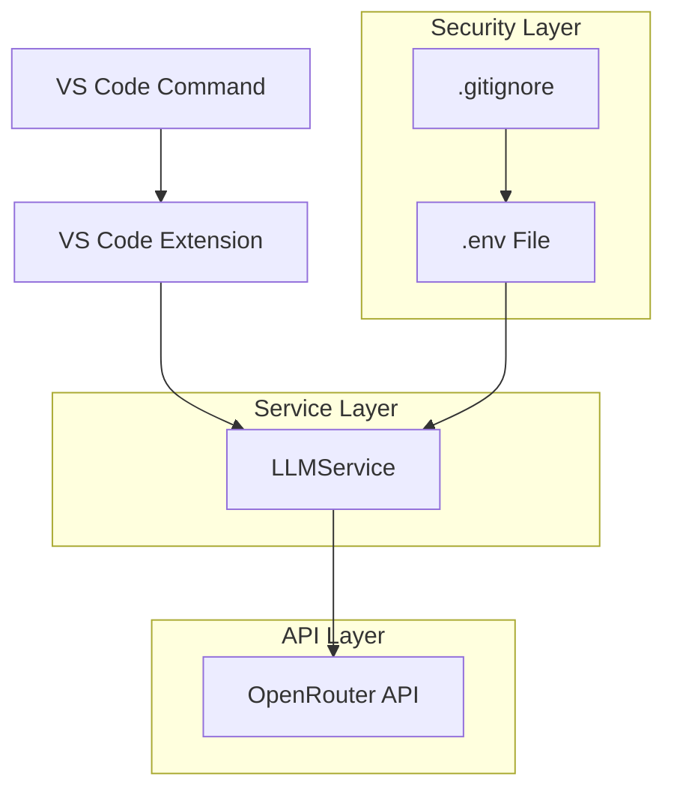

# Design Document

## Overview

This design establishes a secure, testable connection to the OpenRouter API within the VS Code extension. The implementation follows the existing service-oriented architecture pattern observed in the codebase, with proper separation of concerns between configuration management, API communication, and user interface integration.

The solution uses environment variables for secure credential management, implements a dedicated service class for API interactions, and provides a VS Code command for easy connection testing. The design prioritizes security, error handling, and maintainability while following established patterns in the extension.

## Architecture

### High-Level Components



### Component Interaction Flow

1. **Extension Activation**: Load environment variables using dotenv
2. **Command Registration**: Register `constellation.testLlmConnection` command
3. **Service Instantiation**: Create LLMService instance when needed
4. **API Communication**: Service handles HTTP requests to OpenRouter
5. **Response Handling**: Parse and display results to user

## Components and Interfaces

### Environment Configuration

**File**: `.env` (project root)
```
OPENROUTER_API_KEY="your_api_key_here"
```

**Security**: Added to `.gitignore` to prevent credential exposure

### LLMService Class

**File**: `src/services/LLMService.ts`

```typescript
export class LLMService {
    private readonly apiKey: string;
    private readonly baseUrl: string = 'https://openrouter.ai/api/v1';
    
    constructor();
    public async testConnection(): Promise<string>;
    private buildRequestHeaders(): Record<string, string>;
    private buildRequestBody(): object;
    private parseResponse(response: Response): Promise<string>;
}
```

**Key Methods**:
- `testConnection()`: Main method for testing API connectivity
- `buildRequestHeaders()`: Constructs authorization headers
- `buildRequestBody()`: Creates minimal test request payload
- `parseResponse()`: Extracts message content from API response

### VS Code Command Integration

**Command ID**: `constellation.testLlmConnection`
**Handler**: Instantiates LLMService and calls testConnection()
**Response Display**: Uses `vscode.window.showInformationMessage()` for success, error messages for failures

### Package Dependencies

**New Dependency**: `dotenv` for environment variable management
- Installation: `npm install dotenv`
- Usage: `require('dotenv').config({ path: '.env' })` in extension activation

## Data Models

### API Request Structure

```typescript
interface OpenRouterRequest {
    model: string;           // "mistralai/mistral-7b-instruct"
    messages: Array<{
        role: string;        // "user"
        content: string;     // "Respond with only the word 'OK'"
    }>;
}
```

### API Response Structure

```typescript
interface OpenRouterResponse {
    choices: Array<{
        message: {
            content: string;  // The actual response text
            role: string;     // "assistant"
        };
    }>;
    usage?: {
        prompt_tokens: number;
        completion_tokens: number;
        total_tokens: number;
    };
}
```

### Error Response Structure

```typescript
interface OpenRouterError {
    error: {
        message: string;
        type: string;
        code?: string;
    };
}
```

## Error Handling

### Error Categories

1. **Configuration Errors**
   - Missing API key
   - Invalid .env file format
   - Missing dotenv dependency

2. **Network Errors**
   - Connection timeout
   - DNS resolution failures
   - Network connectivity issues

3. **Authentication Errors**
   - Invalid API key
   - Expired credentials
   - Insufficient permissions

4. **API Errors**
   - Rate limiting
   - Invalid request format
   - Service unavailable

### Error Handling Strategy

```typescript
// Example error handling pattern
try {
    const response = await this.testConnection();
    vscode.window.showInformationMessage(`API Test Success: ${response}`);
} catch (error) {
    const errorMessage = error instanceof Error ? error.message : 'Unknown error';
    vscode.window.showErrorMessage(`API Test Failed: ${errorMessage}`);
    console.error('LLM Connection Test Error:', error);
}
```

### Graceful Degradation

- Service continues to function even if API is unavailable
- Clear error messages guide user toward resolution
- No extension crashes due to API failures
- Proper logging for debugging purposes

## Testing Strategy

### Manual Testing Approach

1. **Command Execution Test**
   - Execute `constellation.testLlmConnection` from Command Palette
   - Verify command appears in VS Code command list
   - Confirm command handler is properly registered

2. **API Connection Test**
   - Test with valid API key - expect success message
   - Test with invalid API key - expect authentication error
   - Test with no API key - expect configuration error
   - Test with network disconnected - expect network error

3. **Security Verification**
   - Confirm `.env` file is in `.gitignore`
   - Verify API key is not logged in console
   - Check that credentials are not exposed in error messages


### Validation Criteria

- All error scenarios produce user-friendly messages
- No sensitive information is exposed in logs or UI
- Extension remains stable under all test conditions
- API responses are properly parsed and displayed
- Command integration works seamlessly with VS Code