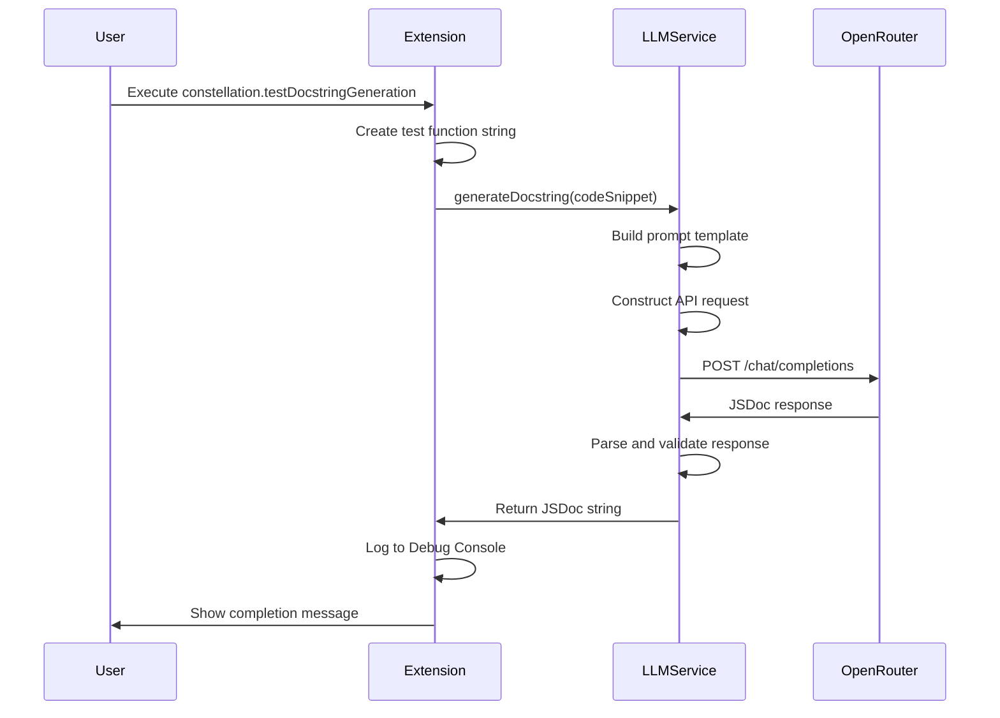

# Design Document

## Overview

The contextual JSDoc generation feature extends the existing LLMService to provide AI-powered documentation generation for TypeScript functions. The system leverages a carefully crafted prompt engineering approach to instruct the OpenRouter API to act as an expert technical writer, analyzing code snippets and generating comprehensive JSDoc comments.

The design follows the established patterns in the codebase, reusing the existing API integration infrastructure while adding a new specialized method for documentation generation. A temporary debug command provides end-to-end testing capabilities to validate the functionality before broader integration.

## Architecture

### High-Level Flow
```
User Command → Extension Command Handler → LLMService.generateDocstring() → OpenRouter API → Parsed JSDoc Response → Debug Console Output
```

### Component Interaction


## Components and Interfaces

### LLMService Extension

**New Method Signature:**
```typescript
public async generateDocstring(codeSnippet: string): Promise<string>
```

**Prompt Template Structure:**
- System prompt defining AI role as expert technical writer
- Specific instructions for JSDoc format requirements
- Code snippet integration with proper formatting
- Response constraints (JSDoc only, no original code)

**Request Building:**
- Reuses existing `buildRequestHeaders()` method
- Creates specialized request body with documentation-focused model selection
- Integrates prompt template with provided code snippet

**Response Processing:**
- Leverages existing `parseResponse()` method for consistency
- Validates JSDoc format in response
- Handles API errors using established error handling patterns

### Extension Command Integration

**Command Registration:**
```typescript
constellation.testDocstringGeneration
```

**Test Function Specification:**
- Multi-line TypeScript function without existing documentation
- Non-trivial logic (age calculation with edge cases)
- Demonstrates parameter handling and return value processing
- Provides realistic testing scenario for JSDoc generation

## Data Models

### Prompt Template Structure
```typescript
interface PromptTemplate {
    systemPrompt: string;    // AI role and general instructions
    codeSection: string;     // Formatted code snippet with markdown
    finalPrompt: string;     // Combined prompt for API request
}
```

### API Request Extension
```typescript
// Extends existing OpenRouterRequest interface
interface DocstringRequest extends OpenRouterRequest {
    messages: [{
        role: 'user';
        content: string;  // Contains formatted prompt with code
    }];
    model: string;        // Optimized for code understanding
}
```

### Response Validation
```typescript
interface DocstringResponse {
    content: string;      // Generated JSDoc comment
    isValid: boolean;     // JSDoc format validation
    hasRequiredTags: {    // Validation flags
        description: boolean;
        params: boolean;
        returns: boolean;
    };
}
```

## Error Handling

### Input Validation
- **Empty Code Snippet**: Return error message for empty or whitespace-only input
- **Invalid TypeScript**: Log warning but attempt generation (AI may provide feedback)
- **Oversized Input**: Truncate or reject based on token limits

### API Error Handling
- **Reuse Existing Patterns**: Leverage established error handling from `parseResponse()`
- **Documentation-Specific Errors**: Handle cases where AI returns non-JSDoc content
- **Rate Limiting**: Apply same rate limit handling as existing methods
- **Authentication**: Use existing authentication error patterns

### Response Validation
- **Format Checking**: Validate response starts with `/**` and ends with `*/`
- **Content Validation**: Ensure presence of description and appropriate tags
- **Fallback Handling**: Provide default JSDoc template if AI response is invalid


### Manual Testing Protocol
1. **Command Execution**: Verify command appears in VS Code command palette
2. **Debug Console Output**: Confirm JSDoc appears in Debug Console
3. **Error Scenarios**: Test with invalid API key, network issues
4. **Response Quality**: Manually review generated JSDoc for accuracy and completeness
5. **Performance**: Monitor response times and token usage

### Validation Criteria
- **Functional**: Generated JSDoc includes function description, parameter docs, return value docs
- **Format**: Output follows JSDoc conventions with proper tags and syntax
- **Integration**: Command executes without errors and logs output correctly
- **Error Handling**: Graceful degradation when API calls fail
- **Performance**: Response time under 10 seconds for typical functions