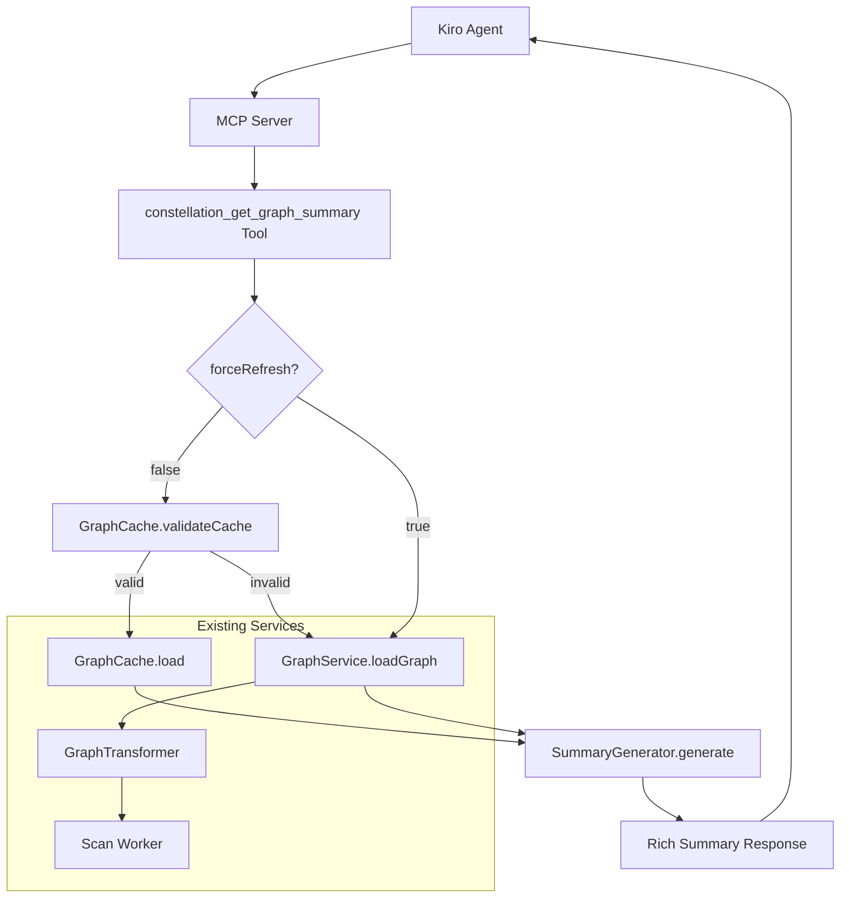
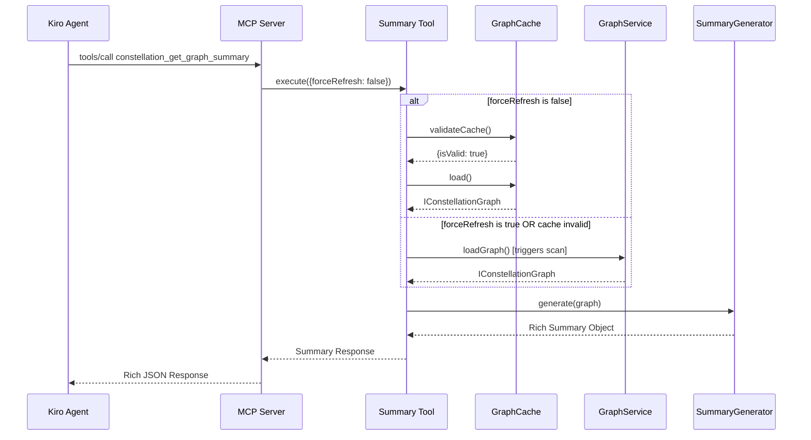

# Design Document

## Overview

The Smart Summary MCP Tool extends the existing Kiro Constellation MCP server with an intelligent `constellation_get_graph_summary` tool that provides rich, actionable insights about the codebase. The design builds upon the established GraphService, GraphCache, and GraphTransformer services to deliver a seamless experience that automatically determines whether to use cached data or trigger a fresh scan.

The tool returns pre-digested summaries with architectural insights including hub analysis, circular dependency detection, and file type breakdowns, completing Phase 1B of the roadmap.

## Architecture

### High-Level Architecture



### Component Interaction Flow



## Components and Interfaces

### 1. MCP Tool Registration

**New Tool Definition:**
```typescript
// In src/types/mcp.types.ts
export const CONSTELLATION_GET_GRAPH_SUMMARY_TOOL: ToolDefinition = {
  name: 'constellation_get_graph_summary',
  description: 'Get intelligent summary of codebase with architectural insights. Automatically uses cache or triggers refresh as needed.',
  inputSchema: {
    type: 'object',
    properties: {
      forceRefresh: {
        type: 'boolean',
        description: 'Force a fresh scan instead of using cached data',
        default: false
      }
    },
    required: []
  }
};
```

### 2. Summary Generator Service

**New Service Interface:**
```typescript
// src/services/summary-generator.service.ts
export interface ISummaryResponse {
  summary: string;
  metrics: {
    fileCount: number;
    dependencyCount: number;
    fileTypeBreakdown: Record<string, number>;
  };
  insights: {
    topHubs: Array<{ id: string; connectionCount: number }>;
    circularDependencies: string[][];
    orphanFiles: string[];
  };
  metadata: {
    scanDurationMs: number;
    cacheUsed: boolean;
  };
}

export class SummaryGenerator {
  static generate(graph: IConstellationGraph, scanDurationMs: number, cacheUsed: boolean): ISummaryResponse;
  
  private static generateNarrativeSummary(graph: IConstellationGraph, insights: any): string;
  private static calculateMetrics(graph: IConstellationGraph): any;
  private static analyzeArchitecture(graph: IConstellationGraph): any;
  private static detectCircularDependencies(graph: IConstellationGraph): string[][];
  private static findTopHubs(graph: IConstellationGraph): Array<{ id: string; connectionCount: number }>;
  private static findOrphanFiles(graph: IConstellationGraph): string[];
  private static analyzeFileTypes(graph: IConstellationGraph): Record<string, number>;
}
```

### 3. MCP Server Tool Handler

**Tool Handler Implementation:**
```typescript
// In MCPStdioServer class
if (name === CONSTELLATION_GET_GRAPH_SUMMARY_TOOL.name) {
  const forceRefresh = (args?.forceRefresh as boolean) || false;
  
  if (!vscode) {
    throw new Error('Graph summary functionality requires VS Code extension context');
  }
  
  const workspaceRoot = vscode.workspace.workspaceFolders?.[0]?.uri.fsPath;
  if (!workspaceRoot) {
    throw new Error('No workspace folder open');
  }
  
  return await this.executeGetGraphSummary(workspaceRoot, forceRefresh, extensionContext);
}
```

### 4. Smart Cache Logic Implementation

**Cache Decision Logic:**
```typescript
// In MCPStdioServer class
private async executeGetGraphSummary(
  workspaceRoot: string, 
  forceRefresh: boolean, 
  extensionContext: any
): Promise<any> {
  const startTime = Date.now();
  let cacheUsed = false;
  let graph: IConstellationGraph;

  try {
    if (!forceRefresh) {
      // Try cache first
      const validation = await GraphCache.validateCache(workspaceRoot);
      
      if (validation.isValid) {
        const cachedGraph = await GraphCache.load(workspaceRoot);
        if (cachedGraph) {
          console.error('[SUMMARY] Using cached graph data');
          graph = cachedGraph;
          cacheUsed = true;
        } else {
          // Cache validation passed but load failed - fall back to scan
          graph = await this.performFreshScan(workspaceRoot, extensionContext);
        }
      } else {
        console.error(`[SUMMARY] Cache invalid: ${validation.reason}`);
        graph = await this.performFreshScan(workspaceRoot, extensionContext);
      }
    } else {
      console.error('[SUMMARY] Force refresh requested');
      graph = await this.performFreshScan(workspaceRoot, extensionContext);
    }

    const scanDurationMs = Date.now() - startTime;
    const summary = SummaryGenerator.generate(graph, scanDurationMs, cacheUsed);

    return {
      content: [{
        type: 'text' as const,
        text: JSON.stringify(summary, null, 2)
      }]
    };

  } catch (error) {
    const errorMessage = error instanceof Error ? error.message : String(error);
    console.error('[SUMMARY ERROR]', errorMessage);
    throw new Error(`Graph summary failed: ${errorMessage}`);
  }
}

private async performFreshScan(workspaceRoot: string, extensionContext: any): Promise<IConstellationGraph> {
  const graphService = GraphService.getInstance();
  return await graphService.loadGraph(workspaceRoot, '.', extensionContext);
}
```

## Data Models

### Summary Response Schema

```typescript
interface ISummaryResponse {
  summary: string;
  metrics: {
    fileCount: number;
    dependencyCount: number;
    fileTypeBreakdown: Record<string, number>;
  };
  insights: {
    topHubs: Array<{ id: string; connectionCount: number }>;
    circularDependencies: string[][];
    orphanFiles: string[];
  };
  metadata: {
    scanDurationMs: number;
    cacheUsed: boolean;
  };
}
```

### Example Response

```json
{
  "summary": "Analyzed 152 files and 310 connections in 4.5s. The project appears moderately complex, with 'src/ui/App.jsx' acting as a central hub. One circular dependency was detected, which may indicate a structural issue.",
  "metrics": {
    "fileCount": 152,
    "dependencyCount": 310,
    "fileTypeBreakdown": {
      "jsx": 45,
      "js": 80,
      "css": 27
    }
  },
  "insights": {
    "topHubs": [
      { "id": "src/ui/App.jsx", "connectionCount": 11 },
      { "id": "src/services/apiClient.js", "connectionCount": 9 }
    ],
    "circularDependencies": [
      ["src/services/A.js", "src/utils/B.js", "src/services/A.js"]
    ],
    "orphanFiles": ["src/assets/logo.svg"]
  },
  "metadata": {
    "scanDurationMs": 4510,
    "cacheUsed": true
  }
}
```

### Circular Dependency Detection Algorithm

```typescript
interface DependencyGraph {
  [nodeId: string]: string[];
}

class CircularDependencyDetector {
  static detect(graph: IConstellationGraph): string[][] {
    const adjList = this.buildAdjacencyList(graph);
    const visited = new Set<string>();
    const recursionStack = new Set<string>();
    const cycles: string[][] = [];

    for (const node of graph.nodes) {
      if (!visited.has(node.id)) {
        this.dfsDetectCycle(node.id, adjList, visited, recursionStack, [], cycles);
      }
    }

    return cycles;
  }

  private static dfsDetectCycle(
    nodeId: string,
    adjList: DependencyGraph,
    visited: Set<string>,
    recursionStack: Set<string>,
    path: string[],
    cycles: string[][]
  ): void {
    visited.add(nodeId);
    recursionStack.add(nodeId);
    path.push(nodeId);

    const neighbors = adjList[nodeId] || [];
    for (const neighbor of neighbors) {
      if (!visited.has(neighbor)) {
        this.dfsDetectCycle(neighbor, adjList, visited, recursionStack, path, cycles);
      } else if (recursionStack.has(neighbor)) {
        // Found a cycle - extract the cycle path
        const cycleStartIndex = path.indexOf(neighbor);
        const cycle = path.slice(cycleStartIndex);
        cycle.push(neighbor); // Close the cycle
        cycles.push([...cycle]);
      }
    }

    recursionStack.delete(nodeId);
    path.pop();
  }
}
```

## Error Handling

### Tool Level Errors
- **Missing Extension Context**: Return descriptive error about VS Code requirement
- **No Workspace Open**: Return user-friendly error message
- **Graph Loading Failures**: Capture and return specific error details
- **Invalid Arguments**: Validate and return schema validation errors

### Cache Level Errors
- **Cache Corruption**: Automatically fall back to fresh scan
- **Permission Errors**: Log warnings, continue with fresh scan
- **File System Errors**: Graceful degradation with appropriate error messages

### Analysis Level Errors
- **Circular Dependency Detection Failures**: Log warnings, return empty array
- **Hub Analysis Failures**: Return partial results with warnings
- **File Type Analysis Errors**: Skip problematic files, continue processing

### Response Generation Errors
- **JSON Serialization Errors**: Return simplified response structure
- **Large Response Handling**: Implement response size limits and truncation
- **Memory Constraints**: Implement streaming for very large graphs

## Testing Strategy

### Performance Tests
- **Response Time**: Measure cache vs fresh scan performance
- **Memory Usage**: Monitor memory consumption during analysis
- **Large Graph Handling**: Test with graphs of 1000+ nodes
- **Concurrent Requests**: Test behavior with multiple simultaneous requests

### Test Data and Scenarios
- **Simple Projects**: Basic dependency structures for algorithm validation
- **Complex Projects**: Real-world codebases with circular dependencies
- **Edge Cases**: Empty projects, single files, disconnected components
- **Error Scenarios**: Corrupted cache, permission issues, invalid graphs

## Implementation Notes

### Technology Choices
- **Existing Service Integration**: Leverages established GraphService, GraphCache, and GraphTransformer
- **JSON Response Format**: Structured for easy consumption by Kiro agents
- **Algorithmic Approach**: Efficient graph algorithms for hub and cycle detection
- **Memory Management**: Careful handling of large graph structures

### Security Considerations
- **Workspace Boundary Enforcement**: All operations restricted to workspace root
- **Path Validation**: Prevent directory traversal attacks
- **Resource Limits**: Implement timeouts and memory limits for analysis
- **Error Information Disclosure**: Avoid exposing sensitive file system details

### Performance Considerations
- **Cache-First Strategy**: Prioritize cached data for fast responses
- **Efficient Algorithms**: O(V+E) complexity for graph analysis algorithms
- **Memory Optimization**: Stream processing for very large graphs
- **Response Size Management**: Implement limits and truncation for large responses

### Extensibility
- **Pluggable Analysis**: Design allows for additional insight types
- **Configurable Thresholds**: Hub detection and other analysis parameters
- **Custom Summary Templates**: Future support for different summary formats
- **Integration Points**: Clear interfaces for additional analysis services