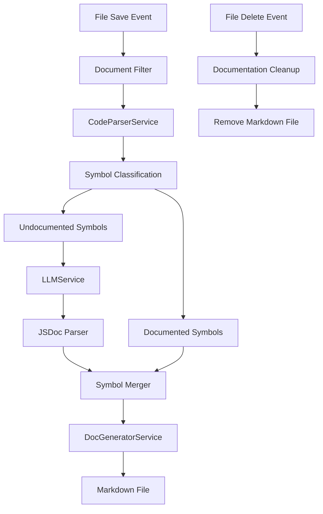

# Design Document

## Overview

The Polaris API Reference Agent transforms the existing symbol-based indexing system into a comprehensive documentation generation system. The agent leverages the current architecture (CodeParserService, LLMService, ManifestService) while introducing a new DocGeneratorService to create professional markdown documentation files that stay synchronized with the codebase.

The core architectural shift moves from "one-symbol-to-one-index" to "one-source-file-to-one-documentation-file", where each TypeScript/JavaScript file generates a corresponding markdown file in the `/docs/api/` directory.

## Architecture

### High-Level Flow



### Service Integration

The system builds upon existing services with targeted enhancements:

- **Extension.ts**: Enhanced with new file event handlers and orchestration logic
- **CodeParserService**: Extended to include raw source text in CodeSymbol objects
- **LLMService**: Enhanced with JSDoc parsing capabilities
- **DocGeneratorService**: New service for markdown generation
- **ManifestService**: Continues current indexing functionality (unchanged)

## Components and Interfaces

### Enhanced CodeSymbol Interface

```typescript
interface CodeSymbol {
    name: string;
    type: 'function' | 'class' | 'interface' | 'type' | 'variable' | 'method' | 'property';
    documentation?: string;
    location: SymbolLocation;
    metadata?: SymbolMetadata;
    sourceText?: string; // NEW: Raw source code for documentation
}
```

### DocGeneratorService

```typescript
interface DocGeneratorService {
    generateFileDoc(filePath: string, symbols: CodeSymbol[]): string;
    formatFunctionSection(symbol: CodeSymbol): string;
    createMarkdownTable(data: Array<{param: string, type: string, description: string}>): string;
    ensureDocsDirectory(): Promise<void>;
    writeDocumentationFile(filePath: string, content: string): Promise<void>;
}
```

### JSDoc Parser Interface

```typescript
interface ParsedJSDoc {
    description: string;
    params: Array<{name: string, type?: string, description: string}>;
    returns?: {type?: string, description: string};
    examples?: string[];
}

interface LLMService {
    // Existing methods...
    parseRawDocstring(rawString: string): ParsedJSDoc;
}
```

## Data Models

### Documentation File Structure

Each generated markdown file follows this structure:

```markdown
# API Reference: [filename]

Brief file description based on exports and primary functionality.

## Functions

### functionName

Function description from JSDoc or AI-generated content.

#### Parameters

| Parameter | Type | Description |
|-----------|------|-------------|
| param1    | string | Parameter description |

#### Returns

| Type | Description |
|------|-------------|
| boolean | Return value description |

#### Source Code

```typescript
function functionName(param1: string): boolean {
    // Complete function implementation
}
```

## Classes

### ClassName

[Similar structure for classes with methods and properties]
```

### File Path Mapping

The system maintains a consistent mapping between source files and documentation:

- Source: `src/services/UserService.ts` → Documentation: `docs/api/UserService.md`
- Source: `src/utils/helpers.js` → Documentation: `docs/api/helpers.md`
- Source: `src/components/Button.tsx` → Documentation: `docs/api/Button.md`

## Error Handling

### LLM Service Failures

When the LLM service fails to generate documentation:

1. **Graceful Degradation**: Use existing JSDoc comments if available
2. **Fallback Generation**: Create basic JSDoc structure with TODO placeholders
3. **Error Logging**: Log failures without blocking the documentation process
4. **Retry Logic**: Implement exponential backoff for transient failures

### File System Errors

Documentation file operations include comprehensive error handling:

1. **Directory Creation**: Ensure `/docs/api/` exists before writing
2. **Permission Errors**: Log and continue with other files
3. **Disk Space**: Handle write failures gracefully
4. **Concurrent Access**: Prevent race conditions during file operations

### Parsing Errors

Symbol extraction errors are handled at the individual symbol level:

1. **Symbol-Level Isolation**: Failed symbol extraction doesn't block other symbols
2. **Partial Documentation**: Generate documentation for successfully parsed symbols
3. **Error Reporting**: Log parsing issues with file and line context

### Performance Testing

1. **Large File Handling**
   - Files with 100+ functions
   - Memory usage monitoring
   - Processing time benchmarks

2. **Concurrent Operations**
   - Multiple file saves simultaneously
   - Race condition prevention
   - Resource contention handling

## Implementation Phases

### Phase 1: Foundation (Checkpoint 1)
- Enhance CodeSymbol interface with sourceText
- Create DocGeneratorService with basic markdown generation
- Implement file-level documentation workflow
- Update extension.ts save handler

### Phase 2: AI Integration (Checkpoint 2)
- Enhance LLMService with JSDoc parsing
- Implement symbol classification (documented vs undocumented)
- Add concurrent LLM processing with Promise.all
- Integrate AI-generated documentation into workflow

### Phase 3: Professional Templates (Checkpoint 3)
- Implement advanced markdown templates
- Add parameter/return value tables
- Include source code sections
- Enhance formatting and styling

### Phase 4: Synchronization (Checkpoint 4)
- Implement file deletion handler
- Add documentation cleanup logic
- Ensure path mapping consistency
- Add error handling for edge cases

## Security Considerations

1. **API Key Management**: LLM service API keys remain in environment variables
2. **File System Access**: Documentation writes are restricted to `/docs/api/` directory
3. **Input Sanitization**: Source code content is sanitized before LLM processing
4. **Resource Limits**: Processing timeouts prevent infinite operations

## Performance Optimizations

1. **Concurrent Processing**: Use Promise.all for multiple undocumented symbols
2. **Caching Strategy**: Cache parsed JSDoc to avoid re-parsing
3. **Incremental Updates**: Only regenerate documentation for changed files
4. **Memory Management**: Stream large files instead of loading entirely into memory