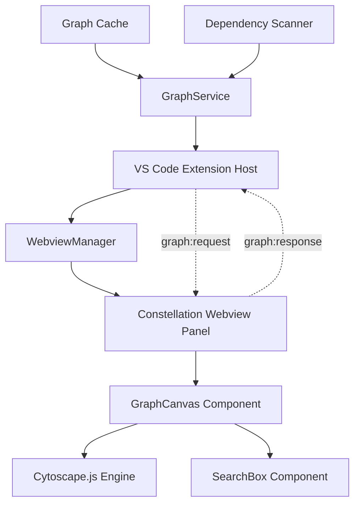

# Design Document

## Overview

The Core Visual Canvas transforms the existing static dependency graph data into an interactive, performant visualization within VS Code's webview panel. This design leverages Cytoscape.js as the rendering engine and integrates with the existing graph service architecture to provide smooth pan/zoom navigation and real-time search capabilities.

## Architecture

### High-Level Architecture



### Component Interaction Flow

1. **Initialization**: User triggers `showGraph` command
2. **Data Request**: Webview sends `graph:request` message to extension host
3. **Data Retrieval**: Extension host uses GraphService to load/cache graph data
4. **Data Response**: Extension host sends `graph:response` with graph JSON
5. **Rendering**: GraphCanvas component initializes Cytoscape.js and renders the graph
6. **Interaction**: User can pan, zoom, and search the rendered graph

## Components and Interfaces

### 1. Message Protocol Extension

Extend the existing message types to support graph data communication:

```typescript
// New message types for graph communication
export interface GraphRequestMessage extends WebviewMessage {
  command: 'graph:request';
}

export interface GraphResponseMessage extends WebviewMessage {
  command: 'graph:response';
  data: {
    graph: IConstellationGraph;
    timestamp: string;
  };
}

export interface GraphErrorMessage extends WebviewMessage {
  command: 'graph:error';
  data: {
    error: string;
    timestamp: string;
  };
}
```

### 2. GraphCanvas Component

Core React component that manages the Cytoscape.js instance:

```typescript
interface GraphCanvasProps {
  graph: IConstellationGraph | null;
  onNodeClick?: (nodeId: string) => void;
  onError?: (error: string) => void;
}

interface GraphCanvasState {
  isLoading: boolean;
  searchQuery: string;
  highlightedNodes: string[];
  cytoscapeInstance: cytoscape.Core | null;
}
```

**Key Responsibilities:**
- Initialize and manage Cytoscape.js instance
- Handle graph data updates and re-rendering
- Implement search functionality with real-time highlighting
- Manage pan/zoom interactions and performance optimization
- Provide error handling and loading states

### 3. SearchBox Component

Dedicated search interface component:

```typescript
interface SearchBoxProps {
  onSearchChange: (query: string) => void;
  placeholder?: string;
  disabled?: boolean;
}
```

**Key Responsibilities:**
- Provide real-time search input
- Debounce search queries for performance
- Display search results count
- Handle keyboard navigation (Enter, Escape)

### 4. WebviewManager Extension

Extend the existing WebviewManager to handle graph-specific messages:

```typescript
// New method in WebviewManager class
private async handleGraphRequest(): Promise<void> {
  try {
    const graphService = GraphService.getInstance();
    const graph = await graphService.getGraph() || 
                  await graphService.loadGraph(workspaceRoot, '.');
    
    const response: GraphResponseMessage = {
      command: 'graph:response',
      data: {
        graph,
        timestamp: new Date().toISOString()
      }
    };
    
    this.currentPanel?.webview.postMessage(response);
  } catch (error) {
    const errorResponse: GraphErrorMessage = {
      command: 'graph:error',
      data: {
        error: error.message,
        timestamp: new Date().toISOString()
      }
    };
    
    this.currentPanel?.webview.postMessage(errorResponse);
  }
}
```

## Data Models

### Cytoscape.js Data Format

Transform IConstellationGraph to Cytoscape.js format:

```typescript
interface CytoscapeNode {
  data: {
    id: string;           // IConstellationNode.id
    label: string;        // IConstellationNode.label
    path: string;         // IConstellationNode.path
    package?: string;     // IConstellationNode.package
  };
}

interface CytoscapeEdge {
  data: {
    id: string;           // Generated: `${source}-${target}`
    source: string;       // IConstellationEdge.source
    target: string;       // IConstellationEdge.target
  };
}

interface CytoscapeElements {
  nodes: CytoscapeNode[];
  edges: CytoscapeEdge[];
}
```

### Search Index

For efficient real-time search, maintain an in-memory search index:

```typescript
interface SearchIndex {
  nodesByLabel: Map<string, string[]>;     // label -> nodeIds
  nodesByPath: Map<string, string[]>;      // path segments -> nodeIds
  nodesByPackage: Map<string, string[]>;   // package -> nodeIds
}
```

## Error Handling

### Error Categories

1. **Data Loading Errors**
   - Graph service failures
   - Cache corruption
   - File system access issues

2. **Rendering Errors**
   - Cytoscape.js initialization failures
   - Large graph performance issues
   - Memory constraints

3. **Interaction Errors**
   - Search query processing failures
   - Layout algorithm failures
   - Browser compatibility issues

### Error Recovery Strategies

```typescript
interface ErrorRecoveryStrategy {
  // Graceful degradation for large graphs
  handleLargeGraph(nodeCount: number): {
    shouldSample: boolean;
    sampleSize?: number;
    showWarning: boolean;
  };
  
  // Fallback rendering options
  handleRenderingFailure(): {
    useSimpleLayout: boolean;
    disableAnimations: boolean;
    reduceVisualEffects: boolean;
  };
  
  // Search fallback
  handleSearchFailure(query: string): {
    useBasicSearch: boolean;
    showErrorMessage: string;
  };
}
```

## Testing Strategy

### Unit Testing Focus Areas

1. **Data Transformation**
   - IConstellationGraph to Cytoscape format conversion
   - Search index generation and querying
   - Message protocol serialization/deserialization

2. **Component Logic**
   - Search query processing and debouncing
   - Node highlighting and filtering logic
   - Error state management

3. **Performance Testing**
   - Large graph rendering (1000+ nodes)
   - Search performance with large datasets
   - Memory usage monitoring

### Integration Testing

1. **Message Flow Testing**
   - Extension host to webview communication
   - Graph data request/response cycle
   - Error message propagation

2. **User Interaction Testing**
   - Pan and zoom performance validation
   - Search functionality end-to-end
   - Graph loading and error scenarios

### Performance Benchmarks

- **Initial Load**: < 2 seconds for graphs up to 500 nodes
- **Search Response**: < 100ms for real-time highlighting
- **Pan/Zoom**: Maintain 60 FPS during interactions
- **Memory Usage**: < 100MB for typical project graphs

## Implementation Considerations

### Cytoscape.js Configuration

```typescript
const cytoscapeConfig = {
  container: containerRef.current,
  elements: cytoscapeElements,
  style: [
    {
      selector: 'node',
      style: {
        'background-color': 'var(--vscode-charts-blue)',
        'label': 'data(label)',
        'text-valign': 'center',
        'text-halign': 'center',
        'font-size': '12px',
        'width': '30px',
        'height': '30px'
      }
    },
    {
      selector: 'edge',
      style: {
        'width': 2,
        'line-color': 'var(--vscode-charts-gray)',
        'target-arrow-color': 'var(--vscode-charts-gray)',
        'target-arrow-shape': 'triangle',
        'curve-style': 'bezier'
      }
    },
    {
      selector: '.highlighted',
      style: {
        'background-color': 'var(--vscode-charts-orange)',
        'line-color': 'var(--vscode-charts-orange)',
        'target-arrow-color': 'var(--vscode-charts-orange)'
      }
    }
  ],
  layout: {
    name: 'cose',
    animate: true,
    animationDuration: 1000,
    fit: true,
    padding: 50
  },
  wheelSensitivity: 0.2,
  minZoom: 0.1,
  maxZoom: 3.0
};
```

### Performance Optimizations

1. **Lazy Loading**: Load graph data only when webview becomes visible
2. **Viewport Culling**: Hide nodes/edges outside visible area for large graphs
3. **Search Debouncing**: 300ms delay for search input processing
4. **Memory Management**: Dispose Cytoscape instance on component unmount
5. **Layout Caching**: Cache layout positions to avoid recalculation

### VS Code Integration

1. **Theme Compatibility**: Use VS Code CSS variables for consistent styling
2. **Keyboard Shortcuts**: Support standard VS Code navigation patterns
3. **Context Menu**: Integrate with VS Code's context menu system
4. **Status Bar**: Show graph statistics in VS Code status bar
5. **Settings**: Respect VS Code's accessibility and performance settings