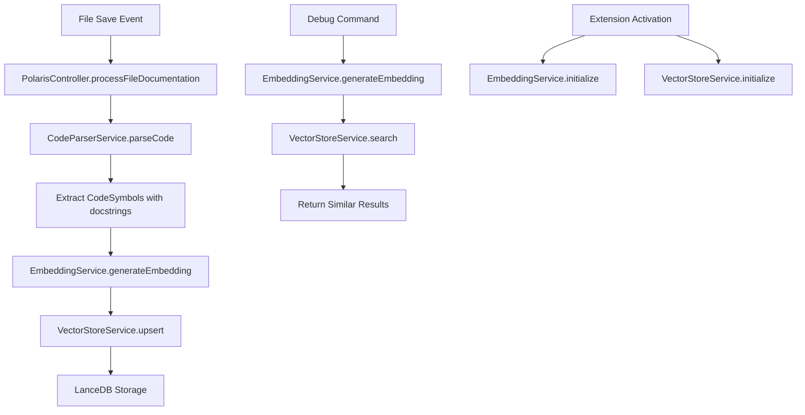

# Design Document

## Overview

The local embedding and vector storage system extends the existing file save workflow to automatically generate semantic embeddings from code docstrings and store them in a persistent vector database. This creates a searchable semantic index that enables natural language queries against code documentation.

The system integrates seamlessly with the existing PolarisController architecture, adding two new singleton services that handle embedding generation and vector storage operations. The design prioritizes performance, reliability, and offline functionality.

## Architecture

### High-Level Architecture



### Integration Points

The system integrates with the existing architecture at these key points:

1. **Extension Activation**: Initialize both services during the `activate()` function
2. **File Save Workflow**: Extend `PolarisController.processFileDocumentation()` to process embeddings after symbol extraction
3. **Command Registration**: Add debug command through existing `CommandController`

## Components and Interfaces

### EmbeddingService

**Purpose**: Manages the local transformer model and generates vector embeddings from text.

**Key Responsibilities**:
- Load and initialize the sentence-transformer model once during extension activation
- Generate consistent vector embeddings from docstring text
- Handle model loading errors and provide fallback behavior
- Manage memory usage and model lifecycle

**Interface**:
```typescript
class EmbeddingService {
    private static instance: EmbeddingService;
    private static pipeline: any;
    
    static async initialize(): Promise<void>
    static getInstance(): EmbeddingService
    async generateEmbedding(text: string): Promise<number[]>
}
```

**Implementation Details**:
- Uses `@xenova/transformers` library with `Xenova/all-MiniLM-L6-v2` model
- Singleton pattern ensures model is loaded only once
- Pipeline configuration: `{ pooling: 'mean', normalize: true }`
- Returns 384-dimensional float vectors
- Handles text preprocessing and normalization

### VectorStoreService

**Purpose**: Manages all interactions with the LanceDB vector database.

**Key Responsibilities**:
- Initialize and maintain connection to LanceDB database
- Create and manage the embeddings table schema
- Perform upsert operations for new embeddings
- Execute similarity searches with vector queries
- Handle database errors and connection issues

**Interface**:
```typescript
class VectorStoreService {
    private static instance: VectorStoreService;
    private db: Database;
    private table: Table;
    
    static async initialize(): Promise<void>
    static getInstance(): VectorStoreService
    async upsert(id: string, text: string, vector: number[]): Promise<void>
    async search(queryVector: number[], limit?: number): Promise<SearchResult[]>
}
```

**Implementation Details**:
- Database location: `/.constellation/vector-store`
- Table name: `embeddings`
- Schema: `{ id: string, text: string, vector: float[] }`
- Unique ID format: `{filePath}:{symbolName}`
- Default search limit: 5 results
- Uses cosine similarity for vector search

### Integration Layer

**Purpose**: Orchestrates the embedding workflow within the existing file save process.

**Key Responsibilities**:
- Extract docstrings from parsed CodeSymbols
- Coordinate between EmbeddingService and VectorStoreService
- Handle errors without disrupting the main documentation workflow
- Provide performance logging and monitoring

**Implementation Location**: Enhanced `PolarisController.processFileDocumentation()`

## Data Models

### Vector Database Schema

```typescript
interface EmbeddingRecord {
    id: string;        // Format: "src/services/utils.ts:myFunction"
    text: string;      // The original docstring text
    vector: number[];  // 384-dimensional embedding vector
}
```

### Search Result Schema

```typescript
interface SearchResult {
    id: string;
    text: string;
    score: number;     // Similarity score (0-1)
}
```

### Unique Identifier Format

The system uses a hierarchical identifier format to ensure uniqueness across the codebase:

- **Format**: `{relativePath}:{symbolName}`
- **Examples**:
  - `src/services/LLMService.ts:generateDocstring`
  - `src/controllers/PolarisController.ts:processFileDocumentation`
  - `src/types.ts:CodeSymbol`

## Error Handling

### Model Loading Failures

**Scenario**: The transformer model fails to load during initialization.

**Handling Strategy**:
- Log detailed error information including model name and error type
- Set a flag to disable embedding generation for the session
- Continue with normal documentation workflow without embeddings
- Show user notification about embedding service unavailability

### Database Connection Issues

**Scenario**: LanceDB connection or table creation fails.

**Handling Strategy**:
- Retry connection with exponential backoff (3 attempts)
- Log connection errors with context information
- Gracefully degrade to skip vector storage operations
- Ensure main documentation workflow continues uninterrupted

### Embedding Generation Errors

**Scenario**: Individual embedding generation fails for specific docstrings.

**Handling Strategy**:
- Log the specific docstring and error details
- Continue processing remaining docstrings
- Track success/failure rates for monitoring
- Don't block the file save workflow

### Vector Storage Failures

**Scenario**: Upsert operations fail due to database issues.

**Handling Strategy**:
- Log the failed operation with full context
- Implement retry logic for transient failures
- Continue with remaining upsert operations
- Provide user feedback for persistent failures


### Performance Testing

**Benchmarks**:
- Model loading time and memory usage
- Embedding generation speed for various text lengths
- Database operation performance (upsert/search)
- Overall impact on file save workflow timing

**Scalability Testing**:
- Large codebase processing (1000+ files)
- Concurrent embedding generation
- Database growth and query performance
- Memory usage patterns over time

## Dependencies

### New Dependencies

```json
{
  "@xenova/transformers",
  "@lancedb/lancedb"
}
```

### Dependency Justification

**@xenova/transformers**:
- Provides local transformer model execution in Node.js
- No external API dependencies for offline functionality
- Optimized for sentence embedding tasks
- Well-maintained with good TypeScript support

**@lancedb/lancedb**:
- High-performance vector database with TypeScript support
- Local storage without external dependencies
- Efficient similarity search capabilities
- Handles large-scale vector operations

## Performance Considerations

### Model Loading Optimization

- Load model once during extension activation
- Use lazy loading to avoid blocking extension startup
- Implement model caching to persist across sessions
- Monitor memory usage and implement cleanup if needed

### Embedding Generation Efficiency

- Process docstrings asynchronously to avoid blocking UI
- Implement batching for multiple embeddings
- Cache embeddings to avoid regeneration for unchanged docstrings
- Use worker threads for CPU-intensive operations if needed

### Database Performance

- Use batch upsert operations when possible
- Implement connection pooling for concurrent operations
- Monitor database file size and implement cleanup strategies
- Optimize vector search with appropriate indexing

### Memory Management

- Monitor transformer model memory usage
- Implement garbage collection triggers for large operations
- Use streaming for large batch operations
- Set reasonable limits on concurrent operations

## Security Considerations

### Local Data Storage

- Store vector database in user's workspace directory
- Ensure proper file permissions for database files
- Implement data cleanup on extension uninstall
- Respect user privacy by keeping all data local

### Model Security

- Use verified transformer models from trusted sources
- Implement model integrity checks during loading
- Handle model loading failures securely
- Avoid exposing sensitive information in error logs

## Future Enhancements

### Advanced Search Features

- Implement hybrid search combining vector and keyword matching
- Add search result ranking and filtering options
- Support for multi-modal embeddings (code + documentation)
- Integration with existing IDE search functionality

### Performance Optimizations

- Implement incremental embedding updates
- Add support for distributed vector storage
- Optimize for specific programming languages
- Implement smart caching strategies

### User Experience Improvements

- Add configuration options for model selection
- Implement search result preview and navigation
- Add metrics and analytics for search effectiveness
- Provide user feedback on embedding quality