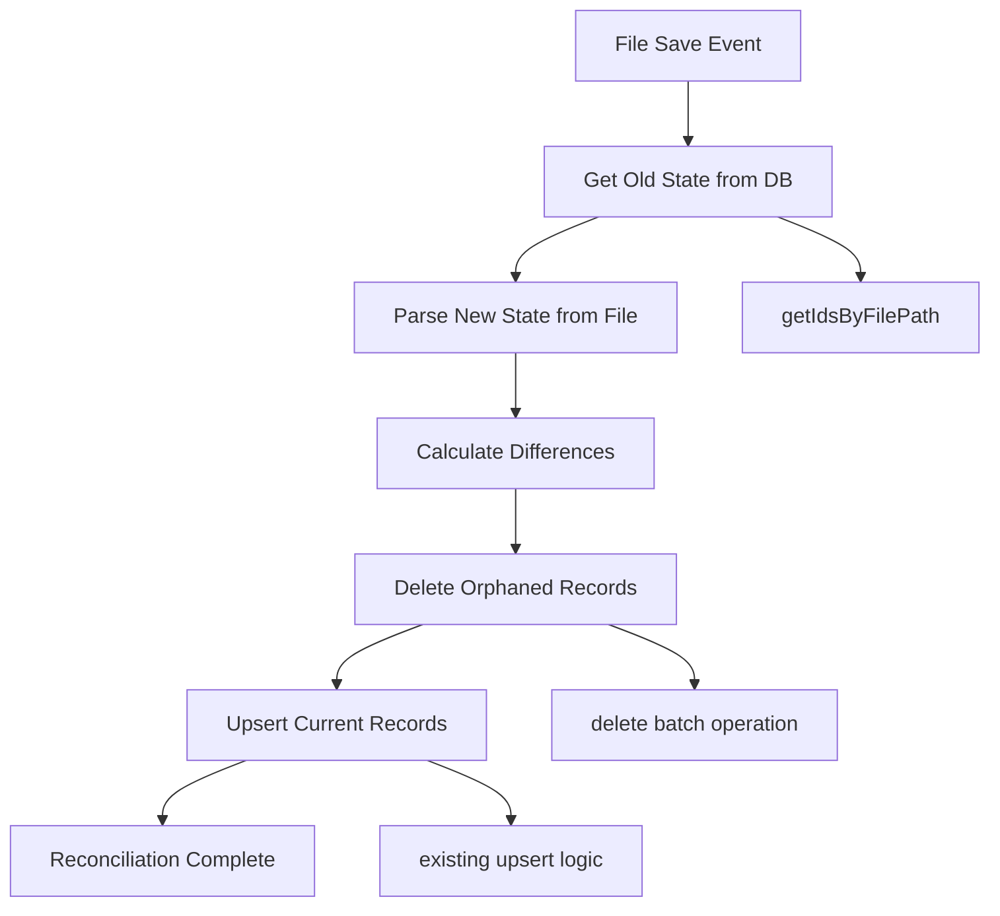

# Design Document

## Overview

The Polaris Engine Reconciliation feature transforms the current "upsert-only" vector store synchronization into a robust reconciliation system that ensures perfect data integrity. The current implementation has a critical flaw: when functions are deleted, renamed, or modified, orphaned records remain in the vector database, leading to stale search results and data inconsistencies.

This design implements a "delete-then-upsert" reconciliation workflow that compares the current file state with the stored database state on every file save, calculating precise differences and executing atomic operations to maintain perfect synchronization.

## Architecture

### Current State Analysis

The existing system has these components:
- **VectorStoreService**: Manages LanceDB operations with `upsert()` and `search()` methods
- **PolarisController**: Orchestrates file processing in `processFileDocumentation()`
- **File Save Handler**: Triggers processing via `onDidSaveTextDocument` in `extension.ts`

### Enhanced Architecture

The reconciliation system adds these capabilities:
- **Schema Enhancement**: Adds `filePath` metadata field for efficient querying
- **Batch Operations**: Implements `getIdsByFilePath()` and `delete()` methods
- **Reconciliation Logic**: Compares old vs new state and executes precise sync operations



## Components and Interfaces

### 1. Enhanced VectorStoreService Schema

**Current Schema:**
```typescript
interface EmbeddingRecord {
    id: string;        // Format: "src/services/utils.ts:myFunction"
    text: string;      // The original docstring text
    vector: number[];  // 384-dimensional embedding vector
}
```

**Enhanced Schema:**
```typescript
interface EmbeddingRecord {
    id: string;        // Format: "src/services/utils.ts:myFunction"
    text: string;      // The original docstring text
    vector: number[];  // 384-dimensional embedding vector
    filePath: string;  // NEW: Absolute file path for efficient querying
}
```

### 2. New VectorStoreService Methods

```typescript
class VectorStoreService {
    // Enhanced upsert method with filePath parameter
    public async upsert(
        id: string, 
        text: string, 
        vector: number[], 
        filePath: string
    ): Promise<void>

    // New method to retrieve all record IDs for a specific file
    public async getIdsByFilePath(filePath: string): Promise<string[]>

    // New method to delete multiple records efficiently
    public async delete(ids: string[]): Promise<void>
}
```

### 3. Reconciliation Workflow Interface

```typescript
interface ReconciliationState {
    oldIds: string[];           // IDs currently in database
    newIds: string[];           // IDs from current file parsing
    idsToDelete: string[];      // Orphaned records to remove
    symbolsToUpsert: CodeSymbol[]; // Current symbols to store
}
```

## Data Models

### File Path Normalization

All file paths will be normalized to ensure consistent querying:
- Convert backslashes to forward slashes
- Remove leading slashes
- Use absolute paths for storage but relative paths for ID generation

### ID Generation Strategy

The existing ID format `"filePath:symbolName"` remains unchanged, ensuring backward compatibility. The new `filePath` field stores the absolute file path for efficient database queries.

### Database Migration Strategy

Since LanceDB doesn't support schema migrations, the system will:
1. Detect missing `filePath` field during initialization
2. Delete the existing `.constellation/vector-store` directory
3. Recreate the database with the new schema
4. Log the migration clearly for user awareness

## Error Handling

### Database Operation Failures

```typescript
interface ReconciliationError {
    phase: 'retrieval' | 'deletion' | 'upsert';
    operation: string;
    error: Error;
    recoverable: boolean;
}
```

**Error Recovery Strategy:**
- **Retrieval Failures**: Fall back to full re-indexing (delete all + upsert all)
- **Deletion Failures**: Abort reconciliation to prevent partial state
- **Upsert Failures**: Use existing retry logic with exponential backoff

### Partial Failure Handling

If deletion succeeds but upsert fails, the system will:
1. Log the inconsistent state
2. Attempt to restore previous state if possible
3. Mark the file for re-processing on next save
4. Notify user of the issue

### Concurrency Protection

The existing `processingTasks` Map in PolarisController already prevents concurrent processing of the same file, ensuring reconciliation operations are atomic per file.

## Testing Strategy

### Unit Tests

1. **Schema Migration Tests**
   - Test database recreation with new schema
   - Verify backward compatibility with existing data
   - Test error handling during migration

2. **Reconciliation Logic Tests**
   - Test difference calculation (additions, deletions, modifications)
   - Test edge cases (empty files, all symbols deleted, all symbols new)
   - Test ID normalization and matching

3. **Database Operation Tests**
   - Test `getIdsByFilePath()` with various file paths
   - Test batch `delete()` operations
   - Test enhanced `upsert()` with filePath parameter

### Integration Tests

1. **End-to-End Reconciliation**
   - Create file with symbols → save → verify database state
   - Modify symbols → save → verify old records deleted, new records added
   - Delete symbols → save → verify orphaned records removed
   - Rename file → verify old file records cleaned up

2. **Error Scenario Tests**
   - Database unavailable during reconciliation
   - Partial operation failures
   - Concurrent file modifications

### Performance Tests

1. **Large File Handling**
   - Test reconciliation with files containing 100+ symbols
   - Measure performance impact of batch operations
   - Verify memory usage during large reconciliations

2. **Batch Operation Efficiency**
   - Compare performance of batch delete vs individual deletes
   - Test query performance with filePath indexing
   - Measure reconciliation overhead vs simple upsert

## Implementation Phases

### Phase 1: Schema Enhancement
- Add `filePath` field to EmbeddingRecord interface
- Implement database migration logic
- Update `upsert()` method signature and implementation
- Update all call sites to pass filePath parameter

### Phase 2: Query and Delete Operations
- Implement `getIdsByFilePath()` method with proper SQL escaping
- Implement batch `delete()` method with error handling
- Add comprehensive logging and error categorization
- Test database operations in isolation

### Phase 3: Reconciliation Integration
- Modify `processFileDocumentation()` in PolarisController
- Implement reconciliation state calculation
- Add reconciliation workflow with proper error handling
- Integrate with existing embedding processing pipeline

### Phase 4: Testing and Validation
- Comprehensive unit and integration testing
- Performance benchmarking and optimization
- User acceptance testing with real codebases
- Documentation and migration guide creation