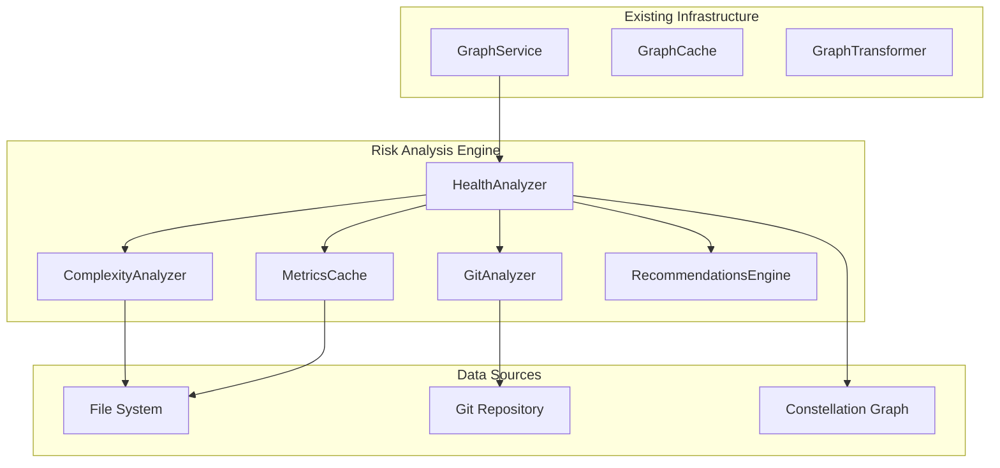

# Design Document

## Overview

The Risk Analysis Engine is a high-performance local computation system that integrates with the existing Kiro Constellation architecture to provide comprehensive codebase health metrics. The engine leverages the existing graph infrastructure, caching mechanisms, and service patterns while introducing specialized services for complexity analysis, git history analysis, and risk score calculation.

The system follows a layered architecture with clear separation of concerns: data collection (complexity and churn analysis), computation (risk scoring), caching (performance optimization), and presentation (health analysis reporting). All operations are designed to be deterministic, cacheable, and performant at scale.

## Architecture

### High-Level Architecture



### Service Integration Pattern

The Risk Analysis Engine integrates with the existing GraphService singleton pattern and leverages the established caching infrastructure. The HealthAnalyzer service acts as the main orchestrator, coordinating between specialized analyzers and the existing graph data.

### Data Flow

1. **Graph Integration**: HealthAnalyzer receives IConstellationGraph from GraphService
2. **Parallel Analysis**: Files are processed in batches using Promise.all for complexity and churn analysis
3. **Metric Aggregation**: Raw metrics are collected and normalized using percentile-based scoring
4. **Risk Calculation**: Weighted risk scores are calculated with color mapping for visualization
5. **Caching**: Results are cached at multiple levels (complexity, churn, full analysis) with appropriate TTLs
6. **Reporting**: Comprehensive health analysis with recommendations is generated

## Components and Interfaces

### Core Services

#### HealthAnalyzer Service

```typescript
export class HealthAnalyzer {
  private static instance: HealthAnalyzer | null = null;
  private complexityAnalyzer: ComplexityAnalyzer;
  private gitAnalyzer: GitAnalyzer;
  private metricsCache: MetricsCache;
  private recommendationsEngine: RecommendationsEngine;

  static getInstance(): HealthAnalyzer;
  
  async analyzeCodebase(graph: IConstellationGraph): Promise<HealthAnalysis>;
  async analyzeFile(node: IConstellationNode, dependencyCount: number): Promise<FileMetrics>;
  
  private calculateAllRiskScores(allMetrics: FileMetrics[]): RiskScore[];
  private calculateRiskScore(file: FileMetrics, allFiles: FileMetrics[]): RiskScore;
  private getPercentile(value: number, values: number[]): number;
  private scoreToColor(score: number): string;
  private createHealthAnalysis(riskScores: RiskScore[]): HealthAnalysis;
}
```

#### ComplexityAnalyzer Service

```typescript
export class ComplexityAnalyzer {
  private cache: MetricsCache;
  
  async analyzeFile(filePath: string): Promise<ComplexityMetrics>;
  
  private analyzeTypeScript(content: string): ComplexityMetrics;
  private analyzeJavaScript(content: string): ComplexityMetrics;
  private analyzeFallback(content: string): ComplexityMetrics;
  private calculateCyclomaticComplexity(content: string): number;
  private countLinesOfCode(content: string): number;
}
```

#### GitAnalyzer Service

```typescript
export class GitAnalyzer {
  private cache: MetricsCache;
  
  async getFileChurn(filePath: string, days: number = 30): Promise<ChurnMetrics>;
  async getFileAuthors(filePath: string, days: number = 30): Promise<string[]>;
  
  private async execGitCommand(command: string): Promise<string>;
  private async getLastModifiedDate(filePath: string): Promise<Date>;
  private async getDaysSinceLastChange(filePath: string): Promise<number>;
}
```

#### MetricsCache Service

```typescript
export class MetricsCache {
  private cache: Map<string, CacheEntry<any>>;
  
  set<T>(key: string, data: T, ttlMs: number): void;
  get<T>(key: string): T | null;
  clear(): void;
  
  private isExpired(entry: CacheEntry<any>): boolean;
  private generateKey(type: string, filePath: string): string;
}
```

#### RecommendationsEngine Service

```typescript
export class RecommendationsEngine {
  generateRecommendations(analysis: HealthAnalysis): string[];
  
  private findHotspots(riskScores: RiskScore[]): RiskScore[];
  private generateHotspotRecommendation(hotspot: RiskScore): string;
  private generateStatisticalInsights(analysis: HealthAnalysis): string[];
  private generateFunFacts(analysis: HealthAnalysis): string[];
}
```

### Integration Points

#### GraphService Integration

The HealthAnalyzer integrates with the existing GraphService singleton to access dependency graph data:

```typescript
// In HealthAnalyzer
async analyzeCodebase(graph?: IConstellationGraph): Promise<HealthAnalysis> {
  // Use provided graph or get from GraphService
  const targetGraph = graph || GraphService.getInstance().getGraph();
  
  if (!targetGraph) {
    throw new Error('No graph data available. Please scan the project first.');
  }
  
  // Continue with analysis...
}
```

#### Command Integration

New commands will be added to the VS Code extension for health analysis:

```typescript
// In extension.ts
const analyzeHealthDisposable = vscode.commands.registerCommand(
  'constellation.analyzeHealth', 
  async () => {
    const healthAnalyzer = HealthAnalyzer.getInstance();
    const analysis = await healthAnalyzer.analyzeCodebase();
    // Display results in webview or output channel
  }
);
```

## Data Models

### Core Types

```typescript
export interface ComplexityMetrics {
  linesOfCode: number;
  cyclomaticComplexity?: number;  // Optional for MVP
  fileSize: number;
}

export interface ChurnMetrics {
  commitCount: number;        // Last 30 days
  uniqueAuthors: number;      // Last 30 days
  lastModified: Date;
  daysSinceLastChange: number;
}

export interface FileMetrics {
  nodeId: string;
  path: string;
  complexity: ComplexityMetrics;
  churn: ChurnMetrics;
  dependencies: number;  // From graph data
}

export interface RiskScore {
  nodeId: string;
  score: number;          // 0-1 normalized
  percentile: number;     // 0-100
  category: 'low' | 'medium' | 'high' | 'critical';
  color: string;          // Hex color for visualization
  metrics: FileMetrics;   // Raw data for tooltips
}

export interface HealthAnalysis {
  timestamp: string;
  totalFiles: number;
  healthScore: number;    // 0-100 overall score
  riskScores: RiskScore[];
  distribution: {
    low: number;
    medium: number;
    high: number;
    critical: number;
  };
  topRisks: RiskScore[];  // Top 5 highest risk files
  recommendations: string[];
}
```

### Cache Data Models

```typescript
interface CacheEntry<T> {
  data: T;
  timestamp: number;
  ttl: number;
}

// Cache TTL Constants
export const CACHE_TTL = {
  complexity: 7 * 24 * 60 * 60 * 1000,  // 1 week
  churn: 24 * 60 * 60 * 1000,           // 1 day
  analysis: 60 * 60 * 1000               // 1 hour
} as const;
```

## Error Handling

### Graceful Degradation Strategy

The system is designed to handle various failure scenarios gracefully:

#### Git History Unavailable
```typescript
async getFileChurn(filePath: string, days: number = 30): Promise<ChurnMetrics> {
  try {
    // Attempt git analysis
    return await this.performGitAnalysis(filePath, days);
  } catch (error) {
    // Fallback to file system metadata
    console.warn(`Git analysis failed for ${filePath}, using fallback`);
    return this.createFallbackChurnMetrics(filePath);
  }
}

private createFallbackChurnMetrics(filePath: string): ChurnMetrics {
  const stats = fs.statSync(filePath);
  return {
    commitCount: 0,
    uniqueAuthors: 0,
    lastModified: stats.mtime,
    daysSinceLastChange: Math.floor((Date.now() - stats.mtime.getTime()) / (1000 * 60 * 60 * 24))
  };
}
```

#### File Access Errors
```typescript
async analyzeFile(node: IConstellationNode, dependencyCount: number): Promise<FileMetrics> {
  try {
    const [complexity, churn] = await Promise.all([
      this.complexityAnalyzer.analyzeFile(node.path),
      this.gitAnalyzer.getFileChurn(node.path)
    ]);
    
    return { nodeId: node.id, path: node.path, complexity, churn, dependencies: dependencyCount };
  } catch (error) {
    console.warn(`Analysis failed for ${node.path}:`, error);
    
    // Return minimal metrics to keep analysis running
    return {
      nodeId: node.id,
      path: node.path,
      complexity: { linesOfCode: 0, fileSize: 0 },
      churn: { commitCount: 0, uniqueAuthors: 0, lastModified: new Date(0), daysSinceLastChange: 999 },
      dependencies: dependencyCount
    };
  }
}
```

#### Memory Management
```typescript
async analyzeCodebase(graph: IConstellationGraph): Promise<HealthAnalysis> {
  const BATCH_SIZE = 50;
  const batches = this.createBatches(graph.nodes, BATCH_SIZE);
  const allMetrics: FileMetrics[] = [];
  
  for (const batch of batches) {
    try {
      const batchMetrics = await Promise.all(
        batch.map(node => this.analyzeFile(node, this.getDependencyCount(node, graph)))
      );
      allMetrics.push(...batchMetrics);
      
      // Allow garbage collection between batches
      if (global.gc) {
        global.gc();
      }
    } catch (error) {
      console.error(`Batch processing failed:`, error);
      // Continue with next batch
    }
  }
  
  return this.createHealthAnalysis(this.calculateAllRiskScores(allMetrics));
}
```

## Testing Strategy

### Unit Testing Approach

Following the persona.md directive, unit and integration tests will be skipped. However, the design includes testable interfaces and clear separation of concerns to support future testing if needed.

### Manual Testing Strategy

1. **Performance Testing**: Verify analysis completes within 2 seconds for 1,500 files
2. **Cache Validation**: Confirm cached results load within 500ms
3. **Memory Testing**: Monitor memory usage stays under 100MB during analysis
4. **Error Handling**: Test graceful degradation with missing git history
5. **Deterministic Results**: Verify identical inputs produce identical risk scores

### Development Testing Commands

```bash
# Test with large codebase
npm run compile && node -e "
const { HealthAnalyzer } = require('./dist/services/health-analyzer.service.js');
const analyzer = HealthAnalyzer.getInstance();
console.time('analysis');
analyzer.analyzeCodebase().then(result => {
  console.timeEnd('analysis');
  console.log('Files analyzed:', result.totalFiles);
  console.log('Memory usage:', process.memoryUsage());
});
"

# Test cache performance
npm run compile && node -e "
const analyzer = HealthAnalyzer.getInstance();
console.time('first-run');
analyzer.analyzeCodebase().then(() => {
  console.timeEnd('first-run');
  console.time('cached-run');
  return analyzer.analyzeCodebase();
}).then(() => {
  console.timeEnd('cached-run');
});
"
```

## Performance Optimizations

### Parallel Processing Strategy

```typescript
// Batch processing with controlled concurrency
private createBatches<T>(items: T[], batchSize: number): T[][] {
  const batches: T[][] = [];
  for (let i = 0; i < items.length; i += batchSize) {
    batches.push(items.slice(i, i + batchSize));
  }
  return batches;
}

// Efficient dependency counting using existing graph structure
private getDependencyCount(node: IConstellationNode, graph: IConstellationGraph): number {
  return graph.edges.filter(edge => edge.source === node.id || edge.target === node.id).length;
}
```

### Caching Strategy

```typescript
// Multi-level caching with appropriate TTLs
class MetricsCache {
  private static readonly CACHE_KEYS = {
    complexity: (path: string) => `complexity:${path}`,
    churn: (path: string) => `churn:${path}`,
    analysis: (graphHash: string) => `analysis:${graphHash}`
  };
  
  // Cache complexity metrics for 1 week (code doesn't change often)
  async getComplexityMetrics(filePath: string): Promise<ComplexityMetrics | null> {
    return this.get(MetricsCache.CACHE_KEYS.complexity(filePath));
  }
  
  // Cache churn metrics for 1 day (git history changes daily)
  async getChurnMetrics(filePath: string): Promise<ChurnMetrics | null> {
    return this.get(MetricsCache.CACHE_KEYS.churn(filePath));
  }
}
```

### Git Command Optimization

```typescript
// Efficient git commands with minimal data transfer
async getFileChurn(filePath: string, days: number = 30): Promise<ChurnMetrics> {
  const sinceDate = new Date();
  sinceDate.setDate(sinceDate.getDate() - days);
  
  // Single git command to get all needed data
  const gitCommand = [
    'git log',
    `--since="${sinceDate.toISOString()}"`,
    '--format="%an"',
    '--follow',
    '--',
    `"${filePath}"`
  ].join(' ');
  
  const output = await this.execGitCommand(gitCommand);
  const lines = output.trim().split('\n').filter(Boolean);
  const authors = new Set(lines);
  
  return {
    commitCount: lines.length,
    uniqueAuthors: authors.size,
    lastModified: await this.getLastModifiedDate(filePath),
    daysSinceLastChange: await this.getDaysSinceLastChange(filePath)
  };
}
```

### Memory Optimization

```typescript
// Streaming approach for large codebases
async analyzeCodebase(graph: IConstellationGraph): Promise<HealthAnalysis> {
  const BATCH_SIZE = 50;
  const batches = this.createBatches(graph.nodes, BATCH_SIZE);
  
  // Process batches sequentially to control memory usage
  const allMetrics: FileMetrics[] = [];
  
  for (let i = 0; i < batches.length; i++) {
    const batch = batches[i];
    console.log(`Processing batch ${i + 1}/${batches.length}`);
    
    const batchMetrics = await Promise.all(
      batch.map(node => this.analyzeFile(node, this.getDependencyCount(node, graph)))
    );
    
    allMetrics.push(...batchMetrics);
    
    // Clear intermediate data and suggest garbage collection
    if (i % 10 === 0 && global.gc) {
      global.gc();
    }
  }
  
  return this.createHealthAnalysis(this.calculateAllRiskScores(allMetrics));
}
```