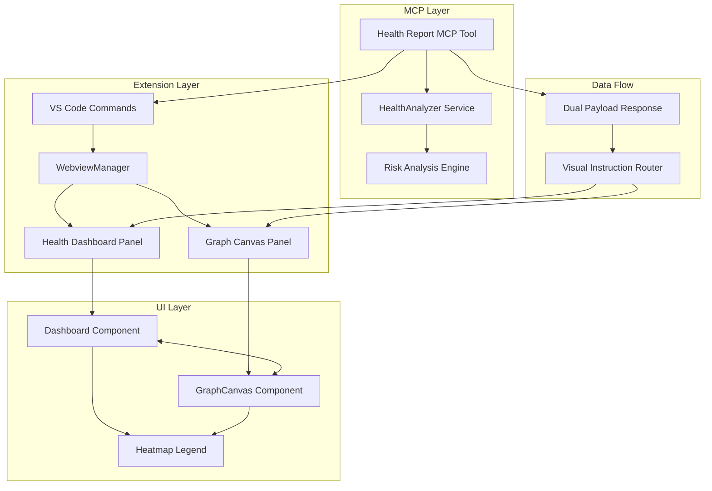

# Design Document

## Overview

The Health Report Feature Integration creates a comprehensive dual-view health reporting system that seamlessly combines analytical insights (dashboard) with visual intelligence (heatmap overlay). This feature builds upon the completed Risk Analysis Engine (spec 07) to provide users with both statistical analysis and visual pattern recognition capabilities. The design leverages the existing MCP infrastructure, webview architecture, and graph visualization components to create a cohesive user experience that transforms invisible technical debt into actionable insights.

The system provides multiple entry points (@constellation health report command, VS Code commands) and ensures smooth transitions between dashboard and graph views while maintaining synchronized state and providing rich interactive features.

## Architecture

### High-Level Architecture



### Component Interaction Flow

1. **MCP Tool Enhancement**: Enhanced health report tool returns dual-view data structure
2. **Dashboard Integration**: Dashboard displays analysis with "View on Graph" trigger
3. **Graph Heatmap Overlay**: Graph canvas applies color-coded risk visualization
4. **Bidirectional Navigation**: Seamless navigation between dashboard and graph views
5. **Command Integration**: Multiple VS Code command entry points

## Components and Interfaces

### 1. MCP Tool Enhancement

#### Enhanced Health Report Tool
```typescript
interface HealthReportToolResponse {
  // For Kiro chat narrative
  summary: string;
  
  // For dashboard view (existing structure)
  dashboardData: {
    healthScore: number;
    distribution: RiskDistribution;
    topRisks: RiskScore[];
    recommendations: string[];
    totalFiles: number;
  };
  
  // For graph heatmap overlay
  visualInstruction: {
    action: 'applyHealthAnalysis';
    type: 'dual-view';
    dashboard: {
      show: boolean;
      data: HealthAnalysis;
    };
    graph: {
      show: boolean;
      heatmapData: HeatmapNode[];
    };
  };
}

interface HeatmapNode {
  nodeId: string;
  score: number;
  color: string;
  metrics: FileMetrics;
}
```

#### Tool Implementation Location
- **File**: `src/mcp/tools/health-report.tool.ts` (new)
- **Integration**: Add to `mcp-stdio.server.ts` tool registry
- **Dependencies**: HealthAnalyzer service, existing MCP infrastructure

### 2. Dashboard Integration Components

#### Enhanced Health Dashboard
```typescript
interface HealthDashboardProps {
  analysis: HealthAnalysis;
  onViewGraph: (riskScores: RiskScore[]) => void;
  onFileClick: (nodeId: string) => void;
  onRefreshAnalysis: () => void;
}

interface DashboardActionButtons {
  viewGraphButton: {
    label: "View Heatmap on Graph";
    icon: "🎨";
    action: () => void;
  };
  refreshButton: {
    label: "Refresh Analysis";
    icon: "🔄";
    action: () => void;
  };
}
```

#### Dashboard Enhancement Location
- **File**: `src/webview/panels/health/components/HealthDashboard.tsx` (new)
- **Styling**: `src/webview/panels/health/styles/health-dashboard.css` (new)
- **Integration**: WebviewManager message handling

### 3. Graph Heatmap Overlay System

#### Heatmap State Management
```typescript
interface HeatmapOverlayState {
  active: boolean;
  riskScores: Map<string, RiskScore>;
  originalStyles: Map<string, CytoscapeNodeStyle>;
  legendVisible: boolean;
}

interface CytoscapeNodeStyle {
  backgroundColor: string;
  borderWidth: number;
  borderColor: string;
  zIndex: number;
}
```

#### Heatmap Methods
```typescript
interface HeatmapMethods {
  applyHeatmapOverlay: (riskScores: RiskScore[]) => void;
  clearHeatmapOverlay: () => void;
  toggleHeatmapOverlay: () => void;
  updateNodeRiskData: (nodeId: string, risk: RiskScore) => void;
}
```

#### Enhanced GraphCanvas Integration
- **File**: `src/webview/panels/constellation/components/GraphCanvas.tsx` (enhanced)
- **New Features**: Heatmap overlay, enhanced tooltips, risk data storage
- **Animation**: 300ms smooth color transitions with easing

### 4. Floating Heatmap Legend

#### Legend Component
```typescript
interface HeatmapLegendProps {
  onClose: () => void;
  onToggle: () => void;
  isActive: boolean;
  riskDistribution?: RiskDistribution;
}

interface LegendControls {
  toggleButton: {
    activeIcon: "👁️";
    inactiveIcon: "👁️‍🗨️";
    tooltip: string;
  };
  closeButton: {
    icon: "✕";
    tooltip: "Close legend";
  };
}
```

#### Legend Implementation
- **File**: `src/webview/panels/constellation/components/HeatmapLegend.tsx` (new)
- **Position**: Floating overlay (absolute positioning)
- **Features**: Risk scale gradient, interaction instructions, statistics

### 5. Bidirectional Navigation System

#### Navigation Message Types
```typescript
interface NavigationMessages {
  // Dashboard → Graph
  'showGraphWithHeatmap': {
    riskScores: RiskScore[];
    focusNodeId?: string;
  };
  
  // Graph → Dashboard
  'dashboard:highlightRisk': {
    nodeId: string;
    risk: RiskScore;
  };
  
  // Universal
  'editor:open': {
    fileId: string;
    openMode: 'default' | 'split';
  };
  
  'graph:focusNode': {
    nodeId: string;
    highlight: boolean;
    showTooltip: boolean;
  };
}
```

#### Navigation Flow Implementation
- **Dashboard Click Handler**: File selection → graph focus → editor open
- **Graph Click Handler**: Node selection → dashboard highlight → editor open
- **Modifier Key Support**: Ctrl/Cmd for split-pane editor opening

## Data Models

### Enhanced Risk Score with Visualization Data
```typescript
interface EnhancedRiskScore extends RiskScore {
  // Existing RiskScore properties
  nodeId: string;
  score: number;
  percentile: number;
  category: 'low' | 'medium' | 'high' | 'critical';
  color: string;
  metrics: FileMetrics;
  
  // New visualization properties
  visualData: {
    borderWidth: number;
    zIndex: number;
    animationDuration: number;
    tooltipData: {
      title: string;
      riskScore: string;
      category: string;
      complexity: string;
      churn: string;
      recommendation?: string;
    };
  };
}
```

### Dual-View Response Structure
```typescript
interface DualViewHealthResponse extends DualToolResponse<HealthAnalysis> {
  dataForAI: HealthAnalysis;
  visualInstruction: {
    action: 'applyHealthAnalysis';
    type: 'dual-view';
    correlationId?: string;
    ts: number;
    dashboard: {
      show: boolean;
      data: HealthAnalysis;
      focusFile?: string;
    };
    graph: {
      show: boolean;
      heatmapData: EnhancedRiskScore[];
      centerNode?: string;
      animationConfig: {
        duration: number;
        easing: string;
      };
    };
  };
}
```

### Webview State Management
```typescript
interface HealthReportState {
  currentView: 'dashboard' | 'graph' | 'dual';
  analysis: HealthAnalysis | null;
  heatmapActive: boolean;
  selectedFile: string | null;
  legendVisible: boolean;
  isLoading: boolean;
  error: string | null;
}
```

## Error Handling

### Graceful Degradation Strategy

1. **Missing Analysis Data**
   - Fallback to cached analysis if available
   - Show loading state with retry option
   - Provide clear error messages with actionable steps

2. **Graph Rendering Failures**
   - Fallback to dashboard-only view
   - Show warning about limited functionality
   - Maintain core analysis capabilities

3. **Heatmap Overlay Issues**
   - Gracefully disable heatmap features
   - Preserve dashboard functionality
   - Log errors for debugging

4. **Navigation Failures**
   - Fallback to basic file opening
   - Show toast notifications for failed actions
   - Maintain user context

### Error Recovery Mechanisms
```typescript
interface ErrorRecoveryConfig {
  maxRetries: number;
  retryDelay: number;
  fallbackStrategies: {
    analysisFailure: 'cache' | 'simplified' | 'error';
    graphFailure: 'dashboard-only' | 'retry' | 'error';
    heatmapFailure: 'disable' | 'retry' | 'ignore';
  };
}
```

## Testing Strategy

### Unit Testing Focus Areas

1. **MCP Tool Enhancement**
   - Dual payload response structure validation
   - Health analysis data transformation
   - Error handling for invalid graph data

2. **Dashboard Integration**
   - Button click handlers and navigation
   - File selection and highlighting
   - State management and updates

3. **Heatmap Overlay System**
   - Color calculation and application
   - Animation timing and easing
   - Style preservation and restoration

4. **Navigation System**
   - Message routing and handling
   - Modifier key detection
   - Cross-panel synchronization

### Integration Testing Scenarios

1. **End-to-End Flow Testing**
   - @constellation health report → dashboard → graph → editor
   - Command palette → direct graph view
   - File selection → cross-panel navigation

2. **Performance Testing**
   - Large graph heatmap rendering (1000+ nodes)
   - Animation performance during transitions
   - Memory usage during extended sessions

3. **Error Scenario Testing**
   - Network failures during analysis
   - Invalid graph data handling
   - Missing file scenarios

### Visual Testing Requirements

1. **Color Accuracy**
   - Risk score to color mapping validation
   - Theme compatibility (light/dark)
   - Accessibility compliance (contrast ratios)

2. **Animation Quality**
   - Smooth 60 FPS transitions
   - Proper easing curves
   - No visual artifacts during state changes

3. **Layout Responsiveness**
   - Dashboard component scaling
   - Legend positioning across screen sizes
   - Graph canvas adaptation

## Performance Considerations

### Optimization Strategies

1. **Heatmap Rendering**
   - Batch node style updates
   - Use requestAnimationFrame for smooth animations
   - Implement viewport culling for large graphs

2. **Memory Management**
   - Clean up event listeners on component unmount
   - Dispose of Cytoscape instances properly
   - Cache frequently accessed risk data

3. **State Synchronization**
   - Debounce rapid state changes
   - Use efficient diff algorithms for updates
   - Minimize unnecessary re-renders

### Performance Targets
- **Heatmap Application**: < 500ms for graphs up to 1000 nodes
- **Animation Frame Rate**: Consistent 60 FPS during transitions
- **Memory Usage**: < 100MB additional overhead for heatmap features
- **Initial Load Time**: < 2 seconds for complete dual-view setup

## Security Considerations

### Data Validation
- Validate all risk score data before visualization
- Sanitize file paths in navigation messages
- Prevent XSS in tooltip content

### Access Control
- Ensure file access respects workspace boundaries
- Validate editor opening permissions
- Secure message passing between components

### Privacy Protection
- No sensitive data in console logs
- Secure handling of file content in tooltips
- Respect user privacy settings for analytics

## Accessibility Features

### Keyboard Navigation
- Tab navigation through dashboard elements
- Keyboard shortcuts for view switching
- Accessible graph node selection

### Screen Reader Support
- ARIA labels for all interactive elements
- Descriptive text for risk visualizations
- Proper heading hierarchy in dashboard

### Visual Accessibility
- High contrast mode support
- Colorblind-friendly risk color palette
- Scalable text and UI elements

## Future Extensibility

### Planned Enhancements
1. **Custom Color Schemes**: User-configurable risk color palettes
2. **Export Capabilities**: Save heatmap visualizations as images
3. **Historical Comparison**: Compare risk analysis across time periods
4. **Team Collaboration**: Share health reports with team members

### Extension Points
- Plugin system for custom risk metrics
- API for external tool integration
- Webhook support for automated reporting
- Custom dashboard widgets