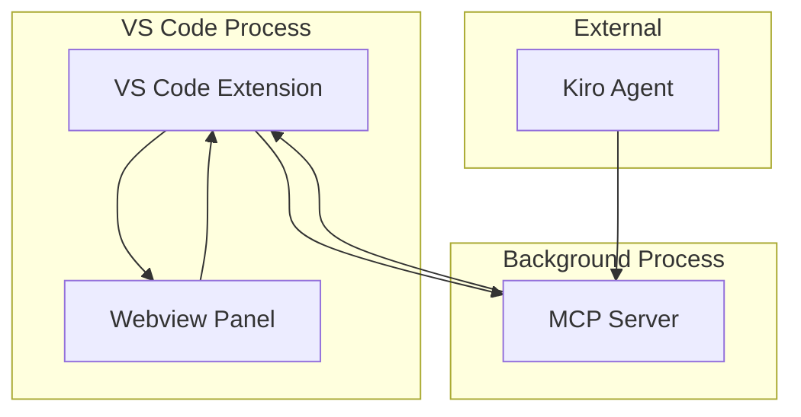
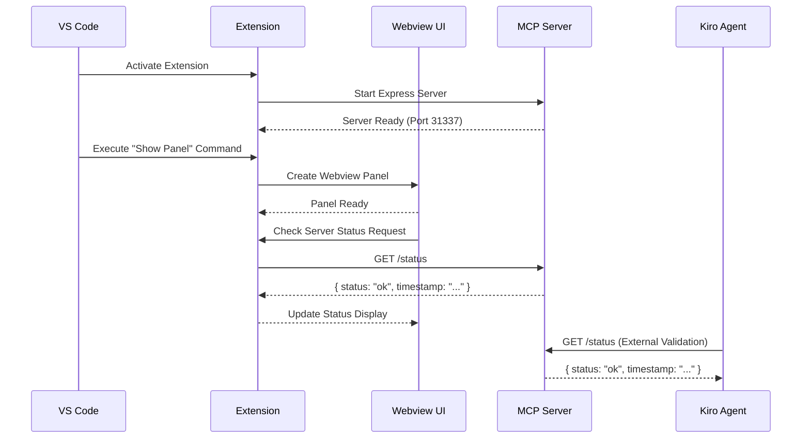

# Design Document

## Overview

The Kiro Constellation POC is designed as a VS Code extension that demonstrates the integration between VS Code's extensibility API, a local MCP (Model Context Protocol) server, and Kiro agent communication. The architecture follows a three-tier approach: the VS Code extension frontend, a webview-based UI layer, and a background Express.js server.

The design prioritizes simplicity and validation of core concepts while establishing patterns that can be extended for the full Kiro Constellation feature set.

## Architecture

### High-Level Architecture



### Component Interaction Flow



## Components and Interfaces

### 1. VS Code Extension Core (`src/extension.ts`)

**Responsibilities:**
- Extension lifecycle management (activate/deactivate)
- Command registration and handling
- MCP server lifecycle management
- Webview panel creation and communication

**Key Interfaces:**
```typescript
interface ExtensionContext {
  activate(context: vscode.ExtensionContext): void;
  deactivate(): Promise<void>;
}

interface ServerManager {
  startServer(): Promise<void>;
  stopServer(): Promise<void>;
  getServerStatus(): Promise<ServerStatus>;
}

interface WebviewManager {
  createPanel(): vscode.WebviewPanel;
  handleMessage(message: any): Promise<void>;
}
```

### 2. MCP Server (`src/server/mcpServer.ts`)

**Responsibilities:**
- Express.js server initialization
- Status endpoint implementation
- Graceful shutdown handling

**Key Interfaces:**
```typescript
interface MCPServer {
  start(port: number): Promise<void>;
  stop(): Promise<void>;
  isRunning(): boolean;
}

interface StatusResponse {
  status: "ok" | "error";
  timestamp: string;
  port?: number;
}
```

**API Endpoints:**
- `GET /status` - Returns server status and timestamp

### 3. Webview UI (`src/webview/`)

**Responsibilities:**
- Preact-based user interface rendering
- Status display and user interactions
- Communication with extension backend

**Component Structure:**
```typescript
interface ConstellationPanelProps {}

interface StatusIndicatorProps {
  status: string;
  onCheckStatus: () => void;
}

interface ServerStatusButtonProps {
  onClick: () => void;
  disabled?: boolean;
}
```

### 4. Build System

**Responsibilities:**
- Preact JSX compilation
- TypeScript transpilation
- Bundle generation for webview consumption

**Configuration:**
- Primary build: esbuild for extension code
- Webview build: separate esbuild configuration for Preact UI
- Output: `dist/extension.js` and `dist/webview.js`

## Data Models

### Server Status Model
```typescript
interface ServerStatus {
  status: "ok" | "error" | "unknown";
  timestamp: string;
  port?: number;
  error?: string;
}
```

### Webview Message Protocol
```typescript
interface WebviewMessage {
  command: "checkStatus" | "statusUpdate";
  data?: any;
}

interface StatusUpdateMessage extends WebviewMessage {
  command: "statusUpdate";
  data: {
    status: string;
    timestamp: string;
  };
}
```

## Error Handling

### Extension Level
- **Server Start Failures**: Log errors, show user notification, graceful degradation
- **Port Conflicts**: Attempt alternative ports (31338, 31339, etc.)
- **Webview Creation Failures**: Log errors, show fallback message

### Server Level
- **Express Server Errors**: Proper error logging and graceful shutdown
- **Endpoint Errors**: Return appropriate HTTP status codes with error messages
- **Resource Cleanup**: Ensure proper cleanup on process termination

### UI Level
- **Communication Failures**: Display error states in status indicator
- **Network Timeouts**: Show timeout messages with retry options
- **Invalid Responses**: Handle malformed server responses gracefully

## Testing Strategy

### Unit Tests
- **Extension Functions**: Test command registration, server management, webview creation
- **Server Endpoints**: Test /status endpoint responses and error conditions
- **UI Components**: Test Preact component rendering and user interactions

### Integration Tests
- **Extension-Server Communication**: Test full communication flow
- **Webview-Extension Messaging**: Test message passing between webview and extension
- **Server Lifecycle**: Test server start/stop during extension activation/deactivation

### End-to-End Validation
- **Command Palette Integration**: Verify command appears and executes correctly
- **Panel Display**: Verify webview panel opens with correct content
- **Status Check Flow**: Verify complete status check from UI to server and back
- **Kiro Agent Communication**: External validation of server accessibility

### Test Data and Scenarios
- **Happy Path**: Normal activation, panel opening, status checking
- **Error Scenarios**: Server start failures, network issues, invalid responses
- **Edge Cases**: Multiple panel instances, rapid activation/deactivation cycles

## Implementation Notes

### Technology Choices
- **Express.js**: Chosen for MCP server due to simplicity and Node.js ecosystem compatibility
- **Preact**: Selected over React for smaller bundle size while maintaining familiar JSX syntax
- **esbuild**: Used for fast compilation and bundling of both extension and webview code
- **Port 31337**: Selected as default port, with fallback mechanism for conflicts

### Security Considerations
- Server runs on localhost only (127.0.0.1)
- No authentication required for POC (local access only)
- CORS headers configured for webview communication

### Performance Considerations
- Lazy server initialization (start only when needed)
- Efficient webview resource loading
- Minimal bundle sizes through esbuild optimization